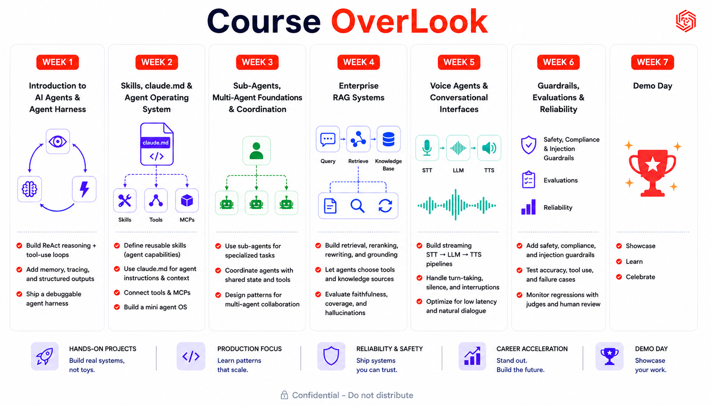

# Agent Engineering Bootcamp

A 7-week, hands-on course on building real AI agents: from a single ReAct loop built by hand, through sub-agents and multi-agent orchestration, RAG, voice interfaces, and production guardrails, ending in a demo day where you ship something real.

Every module in this repo works the same way: learn the concept, then build it, locally, with Claude Code as your build partner. Run by [Traversaal.ai](https://traversaal.ai), in partnership with Leidos.



## By the end of this bootcamp, you will be able to

- Build production-ready AI agents with memory, tools, planning, and observability
- Deploy and optimize open-source LLMs for cost, latency, and scale
- Engineer advanced Agentic RAG systems using multimodal retrieval, Knowledge Graph RAG, and semantic caching
- Create real-time voice agents with streaming STT to LLM to TTS pipelines
- Ship trustworthy AI applications with guardrails, evaluations, safety controls, and production monitoring

## The 7 weeks

| Week | Focus | What you'll learn |
|---|---|---|
| **1** | Introduction to AI Agents & Agent Harness | Understand agents. Learn the core components of an agent harness. Understand loops, state, memory, and stop conditions. Build ReAct reasoning and tool-use loops. |
| **2** | Skills, claude.md & Agent Operating System | Define reusable skills as agent capabilities. Use claude.md for agent instructions and context. Connect tools and MCPs. PRD generation and app creation using Claude Code. |
| **3** | Sub-Agents, Multi-Agent Foundations & Coordination | Use sub-agents for specialized tasks. Coordinate agents with shared state and tools. Design patterns for multi-agent collaboration. |
| **4** | Enterprise RAG Systems | Build retrieval, reranking, rewriting, and grounding. Let agents choose tools and knowledge sources. Evaluate faithfulness, coverage, and hallucinations. |
| **5** | Voice Agents & Conversational Interfaces | Build streaming STT to LLM to TTS pipelines. Handle turn-taking, silence, and interruptions. Optimize for low latency and natural dialogue. |
| **6** | Guardrails, Evaluations & Reliability | Add safety, compliance, and injection guardrails. Test accuracy, tool use, and failure cases. Monitor regressions with judges and human review. |
| **7** | Demo Day | Showcase what you built. See [Demo Day](#demo-day) below for the format. |

## Demo Day

- **Format:** 3-5 minute presentation plus a live demo, in teams of 5.
- **What your team presents:** the business problem and target users, your AI system architecture and design decisions, a working prototype with a live walkthrough, and your key learnings, limitations, and next steps.
- **Use one or more course topics:** AI agents, multi-agent systems, enterprise RAG, orchestration, voice agents, guardrails and evaluations.

## Schedule (tentative)

Weekly Tuesday sessions, with a break built in.

| Date | Session |
|---|---|
| Aug 11 | Kickoff meeting |
| Aug 18 | Module 1 |
| Aug 25 | Module 2 |
| Sep 1 | Module 3 |
| Sep 8 | Module 4 |
| Sep 15 | Break |
| Sep 22 | Module 5 |
| Sep 29 | Module 6 |
| TBC | Demo Day |

## How we'll learn together

- Attend all live sessions and arrive on time.
- Plan to dedicate roughly 5-6 hours each week to live sessions, assignments, and independent practice.
- Office hours (60 minutes of class plus 30 minutes after) are scheduled when needed for questions and extra support.
- If you need to miss a session, let the course team know in advance.

## Getting started

### Prerequisites

- **Claude Code**, installed and authenticated:
  ```bash
  npm install -g @anthropic-ai/claude-code
  claude --version
  ```
- **Node.js** (LTS) and **Python 3**, for running the tools inside each module.
- **Chrome or Edge**, needed for the PRD Builder's Save-to-folder feature in Module 1 (Safari and Firefox fall back to a slightly different save path).
- **An LLM credential.** Either one of these works, and the tools in this repo accept both:
  - An **Anthropic API key** from [console.anthropic.com](https://console.anthropic.com), used with the default endpoint.
  - An **LLM proxy base URL plus a key issued for that proxy**, if your cohort routes LLM traffic through a gateway such as LiteLLM. Your proxy key is not valid at `api.anthropic.com`, so the endpoint has to change with it. If Claude Code already works through that gateway, the tools read the base URL and the model from your `~/.claude/settings.json` and you configure nothing further. See [`LLM-PROXY-SUPPORT.md`](LLM-PROXY-SUPPORT.md) for the detail.

  Never commit a key. Keep it in a local `.env` file, or paste it into a tool's own key field where a module offers one. Each module says which.
- **Any other API credentials** your cohort provides for building and testing AI features. Keep these out of git the same way, never committed.

### Clone the repo

```bash
git clone https://github.com/traversaal-ai/agent-engineering-leidos.git
cd agent-engineering-leidos
```

## How each module is meant to be used

1. **Read the study material first.** Every module's `study-material/lesson.md` teaches the concepts before you touch a tool.
2. **Do the hands-on part for real.** Nothing in this course is a toy exercise you copy-paste through. Module 1, for example, has you generate an actual PRD for an actual idea, then build an actual app from it.
3. **Use `reference/` when you want more depth** than the lesson gives, on things like agent architecture levels or the Claude Code construct anatomy.
4. **Keep it local first.** No deployment, no backend, no accounts required to complete any module's hands-on work, unless a specific module's content calls for it.

## Who's teaching this

Run by [Traversaal.ai](https://traversaal.ai): Hamza Farooq (Founder), with Jayita Chatterjee and Amina Javaid as co-facilitators, AI Engineers at Traversaal.ai.

## Contributing / extending

Each new week gets its own `module_N_Name/` folder with the same shape: a `README.md`, a `CLAUDE.md`, `study-material/`, and `reference/`, plus whatever tools or code that week's lesson needs. Copy Module 1's structure as the starting template.

## License

All rights reserved. See [`LICENSE`](LICENSE). This repository is provided for participants of the Agent Engineering Bootcamp; no part of it may be copied, distributed, or reused without written permission from Traversaal.ai.
