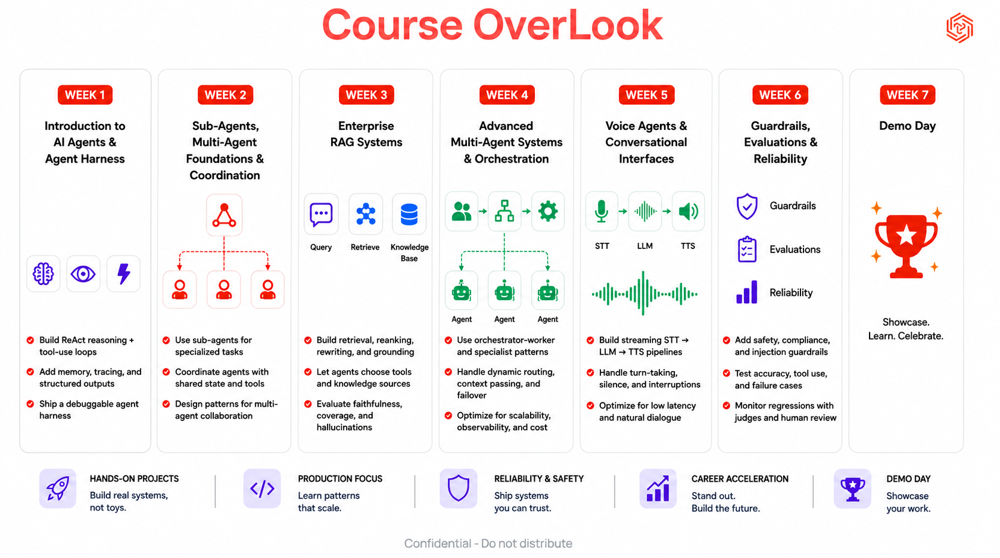

# Agent Engineering Bootcamp

A 7-week, hands-on course on building real AI agents: from a single ReAct loop built by hand, through sub-agents and multi-agent orchestration, RAG, voice interfaces, and production guardrails, ending in a demo day where you ship something real.

Every module in this repo works the same way: learn the concept, then build it, locally, with Claude Code as your build partner. Run by [Traversaal.ai](https://traversaal.ai), in partnership with Leidos.



## By the end of this bootcamp, you will be able to

- Build production-ready AI agents with memory, tools, planning, and observability
- Deploy and optimize open-source LLMs for cost, latency, and scale
- Engineer advanced Agentic RAG systems using multimodal retrieval, Knowledge Graph RAG, and semantic caching
- Create real-time voice agents with streaming STT to LLM to TTS pipelines
- Design coordinated multi-agent systems using orchestration, MCP, and A2A protocols
- Ship trustworthy AI applications with guardrails, evaluations, safety controls, and production monitoring

## The 7 weeks

| Week | Focus | What you'll learn |
|---|---|---|
| **1** | Build ReAct Agents and Agent Harness: Trace, Think, Act, and Control | Understand agents. Learn the core components of an agent harness. Explore CLAUDE.md, MCP, hooks, tools, and project setup. Understand loops, state, memory, and stop conditions. Trace and debug agent behavior, tool calls, and execution history. Build a simple, observable Claude agent with clear boundaries. |
| **2** | Subagents, Agent Teams, and Coordination | Decide between subagents or an agent team. Set up a specialist subagent with the right model, tools, and memory. Understand agent teams: task states, peer messaging, quality hooks. Apply the 90/10 rule (most work goes to subagents; know the 10% worth a full team). Know the ecosystem: real proof points and alternatives. |
| **3** | Build Agentic RAG with Multimodal Retrieval, Graphs & Semantic Cache | Key differences between multimodal RAG approaches and when each fits. Walk through a production-ready RAG system design. Common production RAG challenges and practical solutions. How semantic caching works and why it improves speed. Common semantic cache issues and how to solve them. |
| **4** | Orchestrate Smarter: Design Multi-Agent Systems That Coordinate, Collaborate, and Deliver | Understand the protocols that let agents communicate and coordinate. Use an Agent Development Kit to build, configure, and manage multi-agent systems. Connect agents using MCP and A2A for interoperability and secure collaboration. Evaluate multi-agent systems for performance, reliability, and real-world impact. |
| **5** | Build Voice Agents That Feel Natural: Real-Time STT to LLM to TTS | Build low-latency voice pipelines that reduce delays for real-time conversations. Handle barge-in and interruptions so agents feel responsive. Enable tool use and function calling by voice. Ensure voice quality, low latency, and stable performance. |
| **6** | Ship AI You Can Trust: Guardrails, Safety, and Production Evals That Scale | What evals are and why they matter before pushing agents to production. Evaluation metrics and frameworks to use. Why guardrails matter: preventing unsafe outputs, bad tool calls, data leaks, and production failures. The different types of guardrails, protecting inputs, outputs, tools, permissions, retrieval, and business rules. How to apply guardrails in action, catching failures and blocking risky behavior. |
| **7** | Learning to Launch: Capstone Demo Day for Real-World AI Systems | Showcase what you built. See [Demo Day](#demo-day) below for the format. |

## Demo Day

- **Format:** 3-5 minute presentation plus a live demo, in teams of 5.
- **What your team presents:** the business problem and target users, your AI system architecture and design decisions, a working prototype with a live walkthrough, and your key learnings, limitations, and next steps.
- **Use one or more course topics:** AI agents, multi-agent systems, enterprise RAG, orchestration, voice agents, guardrails and evaluations.

## Schedule

Weekly Tuesday sessions, with two breaks built in.

| Date | Session |
|---|---|
| Aug 11 | Kickoff meeting |
| Aug 18 | Module 1 |
| Aug 25 | Module 2 |
| Sep 1 | Module 3 |
| Sep 8 | Break |
| Sep 15 | Module 4 |
| Sep 22 | Module 5 |
| Sep 29 | Module 6 |
| Oct 6 | Break |
| TBC | Demo Day |

## How we'll learn together

- Attend all live sessions and arrive on time.
- Plan to dedicate roughly 5-6 hours each week to live sessions, assignments, and independent practice.
- Office hours (60 minutes of class plus 30 minutes after) are scheduled when needed for questions and extra support.
- If you need to miss a session, let the course team know in advance.

## Getting started

### Prerequisites

- **Claude Code**, installed and authenticated:
  ```bash
  npm install -g @anthropic-ai/claude-code
  claude --version
  ```
- **Node.js** (LTS) and **Python 3**, for running the tools inside each module.
- **Chrome or Edge**, needed for the PRD Builder's Save-to-folder feature in Module 1 (Safari and Firefox fall back to a slightly different save path).
- An **Anthropic API key**, from [console.anthropic.com](https://console.anthropic.com). Never commit it. Each module explains exactly where it's safe to put it.
- **LLM endpoint access and any other API credentials** your specific cohort provides for building and testing AI features. Keep these out of git the same way, in a local `.env` file, never committed.

### Clone the repo

```bash
git clone https://github.com/traversaal-ai/agent-engineering-leidos.git
cd agent-engineering-leidos
```

### Start with Module 1

```bash
cd "module_1_Intro to Agents"
```

Then open [`module_1_Intro to Agents/README.md`](module_1_Intro%20to%20Agents/README.md) and follow it: read the lesson, generate a PRD for an idea of your own with the PRD Builder, then hand it to Claude Code and build a real local app from it.

## How each module is meant to be used

1. **Read the study material first.** Every module's `study-material/lesson.md` teaches the concepts before you touch a tool.
2. **Do the hands-on part for real.** Nothing in this course is a toy exercise you copy-paste through. Module 1, for example, has you generate an actual PRD for an actual idea, then build an actual app from it.
3. **Use `reference/` when you want more depth** than the lesson gives, on things like agent architecture levels or the Claude Code construct anatomy.
4. **Keep it local first.** No deployment, no backend, no accounts required to complete any module's hands-on work, unless a specific module's content calls for it.

## Who's teaching this

Run by [Traversaal.ai](https://traversaal.ai): Hamza Farooq (Founder), with Jayita Chatterjee and Amina Javaid as co-facilitators, AI Engineers at Traversaal.ai.

## Contributing / extending

Each new week gets its own `module_N_Name/` folder with the same shape: a `README.md`, a `CLAUDE.md`, `study-material/`, and `reference/`, plus whatever tools or code that week's lesson needs. Copy Module 1's structure as the starting template.
