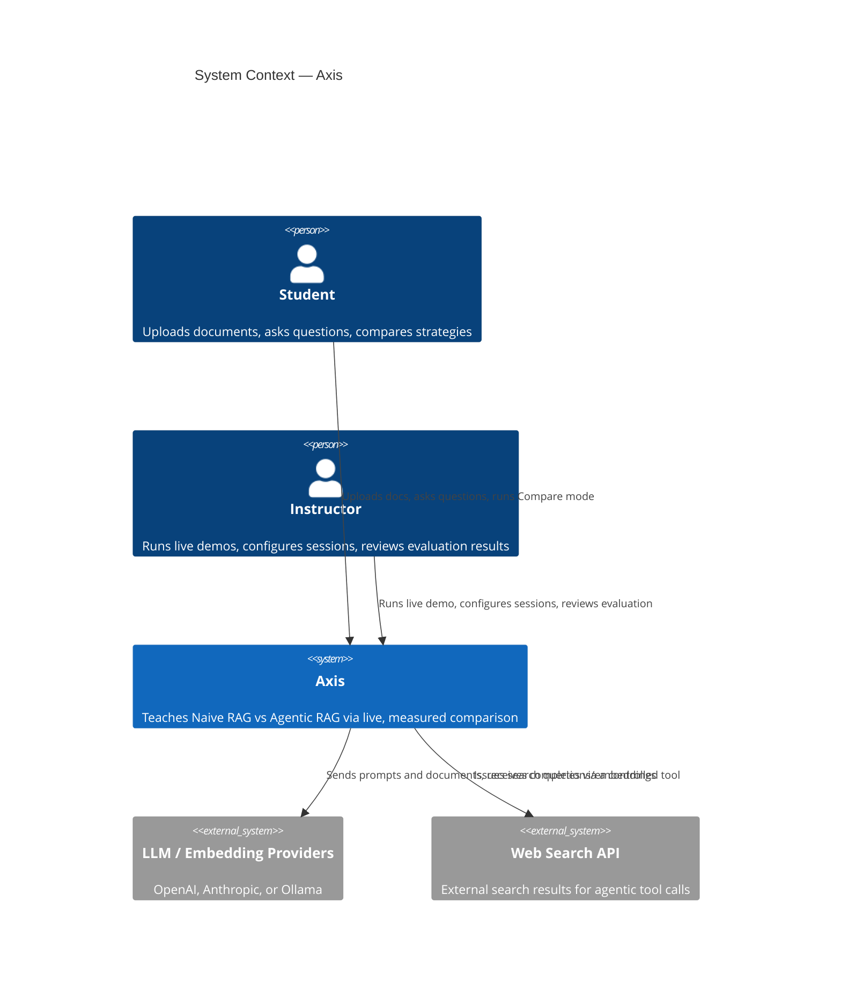
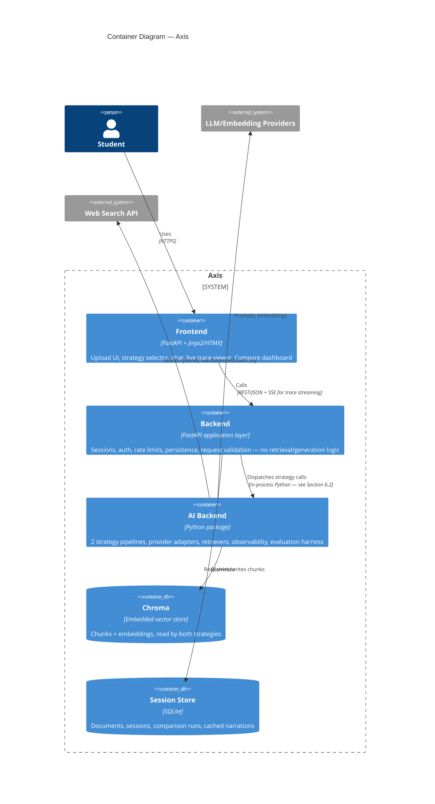
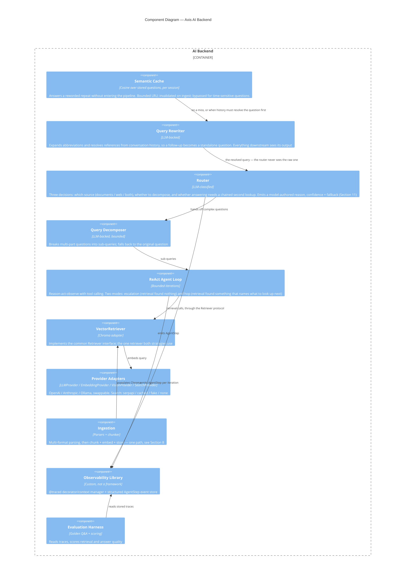
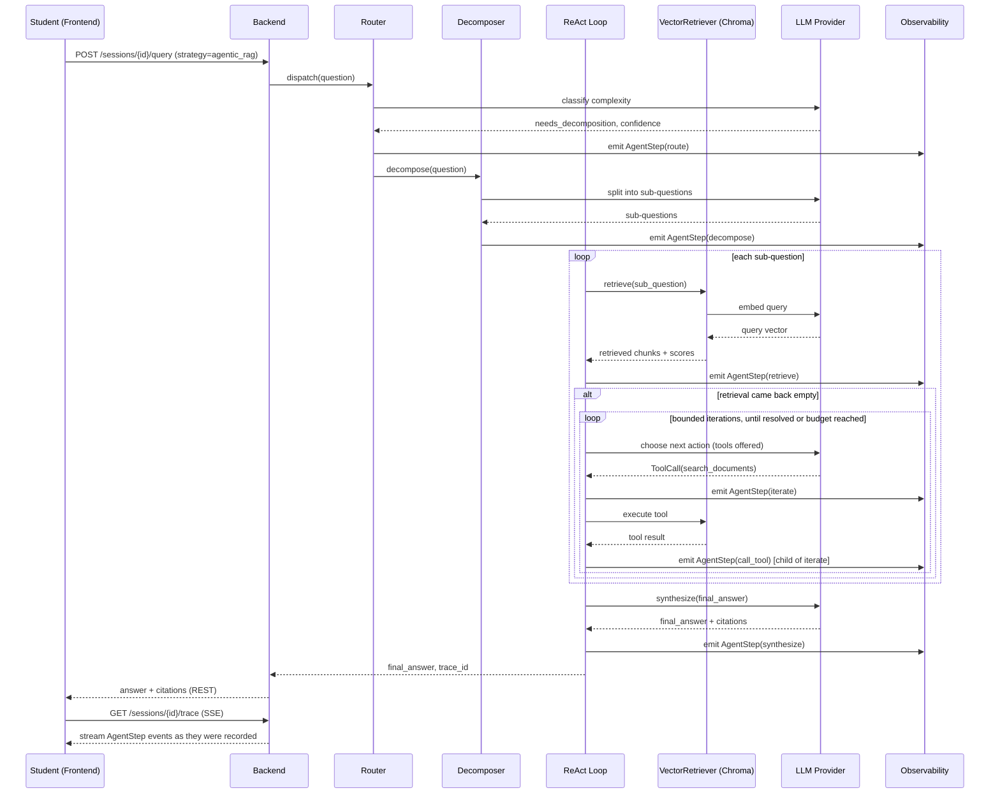
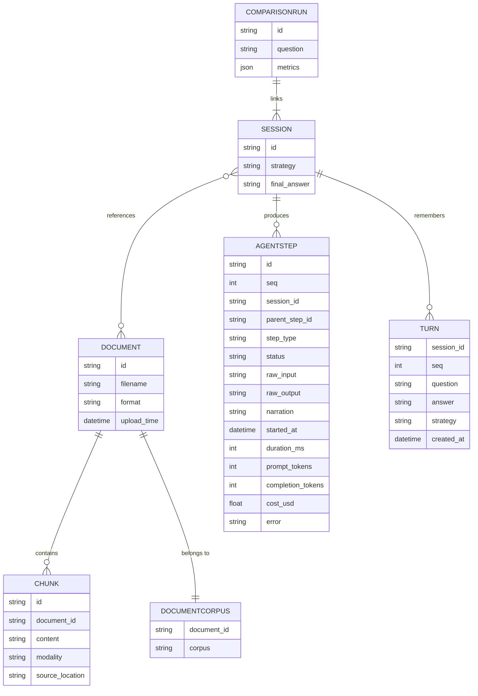

# Axis — System Design Document

*Companion document: Axis_PRD.md covers product scope, goals, and user stories. This
document covers architecture, diagrams, APIs, and technical implementation.*

Diagram approach: this document follows the C4 model (Context → Container → Component),
with supplementary dynamic and data diagrams used sparingly, only where they add real
value — a Component diagram only for the AI Backend (the genuinely complex layer), one
sequence diagram for the single most complex flow (Agentic RAG), and one ER diagram
for the data model. The Frontend and Backend layers are simple enough that Container-level
detail is sufficient; drilling further would add maintenance overhead without adding
clarity.

---

## 1. Architecture Goals & Constraints

Derived from the PRD's Goals (Section 2) and Non-Goals (Section 3):

- Must run reliably on a single machine with no external infrastructure beyond API keys
- Must support live, streaming visibility into every strategy's internal steps
- Must keep Compare mode's four-strategy run under ~45 seconds end-to-end
- Must enforce per-session cost/rate limits before any LLM call, not after
- Explicitly not designed for horizontal scale, multi-tenancy, or production auth

---

## 2. System Context (C4 Level 1)

Axis as a single system, its users, and the external systems it depends on.



---

## 3. Container Diagram (C4 Level 2)

The three layers plus the storage/retrieval containers, matching the PRD's Section 5.1.



**Why Chroma is a container and not an internal detail:** it holds state that outlives a
request and is written by ingestion but read by queries, so drawing it inside the AI Backend
box would hide the one dependency that makes a session stateful. It is embedded — the same
process — which is why the boundary is drawn as ownership rather than as a network hop.

---

## 4. Component Diagram — AI Backend Only (C4 Level 3)

Reserved for the AI Backend specifically, since it's the one container complex enough to
warrant it — the Frontend and Backend containers are simple enough that the Container
diagram above is sufficient detail for them.



**Why this shape matters pedagogically:** every component above the retriever is one
Agentic RAG has and Naive RAG does not. Naive RAG is the same diagram with the cache, the
rewriter, the router, the decomposer and the loop taken out — it calls `VectorRetriever`
directly and then synthesizes. Reading the two strategies off one diagram, as a presence
or absence of orchestration over identical retrieval, is what makes the comparison legible
as a *measurement* rather than as two products that happen to sit side by side.

**What the Router decides — three things, and they are orthogonal.**

| Decision | Values | What it costs |
|---|---|---|
| `SOURCE` | `DOCUMENTS` / `WEB` / `BOTH` | which retrieval path runs, and whether a paid search call happens |
| `COMPLEXITY` | `SIMPLE` / `COMPLEX` | whether the decomposer's LLM call happens |
| `DEPTH` | `SINGLE` / `MULTI_HOP` | whether the ReAct loop is entered on a *successful* retrieval, to chain a second lookup from what the first returned |

They are kept separate deliberately. The reference implementation
(`reference/chapter_07_enterprise_rag/agentic_router.py`) has a single `action` field naming
a source, and leaves sub-query division as an unfinished assignment; Axis has all three,
because collapsing them would delete working capability. A question can be a single lookup
against the web, or a three-part question entirely answerable from the uploaded documents,
or a one-part question that cannot be answered until an earlier lookup names its subject —
and a router that could only say one thing about a question would have to guess the rest.
See `docs/Axis_Notebook_Alignment.md` §2.

**`DEPTH` is what makes multi-hop reachable at all, and it is worth being exact about
why a third field rather than more prompt.** The loop was entered *only* when retrieval
came back empty, and each iteration stopped the moment a tool returned anything. Both are
right for escalation — "the direct search found nothing; did a different phrasing find
something?" — and both are exactly wrong for a hop chain, where the first hop *succeeding*
is the precondition for the second. So the entry condition and the stop condition both
have to change, and neither can change unconditionally without altering every existing
run. A router field is the smallest thing that gates both: with `SINGLE`, escalation
behaviour is byte-identical to before.

`COMPLEXITY` and `DEPTH` are the distinction the course material asks the class to notice
(`Axis_Notebook_Alignment.md` §8): a *comparison* is several independent lookups and needs
decomposition; an *inferential* question is one dependent chain and decomposition cannot
help, because the second question is unknown until the first is answered.

**The source set is not fixed.** `WEB` is offered to the model only when a search provider
is configured; with `AXIS_SEARCH__PROVIDER=none` the option is absent from the prompt
entirely. Offering a model a source it cannot reach produces a confident routing decision
into a dead end — the same reasoning that makes the ReAct loop omit a tool it has no
provider for rather than exposing one that silently returns nothing.

**Fallback stays asymmetric, and now in two dimensions.** An unparseable or low-confidence
classification falls back to `DOCUMENTS` + `SIMPLE`. Guessing `WEB` spends money reaching
outside material the student can verify; guessing `DOCUMENTS` spends nothing extra and, if
wrong, fails visibly in the trace — which is a failure a student can learn from.

**What the Router does not do:** it does not choose the strategy. The student selects that
explicitly through the API, and a router that overrode the choice would destroy the
comparison — a student asking for Naive RAG and silently getting Agentic RAG learns the
opposite of the intended lesson.

**Naive RAG never routes and never reaches the web.** It is the baseline; a baseline with
access to a source the thing being measured against it lacks is not a baseline. This is
also what keeps the orchestration axis honest: if the only way Agentic RAG ever won were
"it can search the web", students would learn *agentic = has web access* rather than
*agentic reasons about retrieval*. PRD Section 6's predicted-outcome set keeps at least one
documents-only question on which decomposition alone wins.

Because the components live in `ai_backend/agents/` rather than inside the Agentic RAG
pipeline, Milestone 3's diff is a single `register()` call. Code placed in the pipeline
module would be reachable only by copying it, which is precisely the "built the agent loop
twice" outcome Section 10's Retriever-abstraction row exists to avoid.

---

## 5. Dynamic View — Agentic RAG Query (Sequence Diagram)

Used sparingly, for exactly the one flow complex enough to need it. Naive RAG is a simpler
subset of this same flow: it skips the Router, the Decomposer and the loop entirely, and
runs one `retrieve` and one `synthesize`. That containment is the point — the baseline is
not a different program, it is this one with the orchestration removed, which is what makes
the difference between them attributable to the orchestration.



**Why the ReAct loop is an escalation path rather than the main path.** An earlier revision
drew a flat `loop each sub-question` in which every sub-question cost an LLM `generate`
call, labelled `AgentStep(call_tool)` — which conflated a tool invocation with a generation
and made "agentic" mean "the same shape, N times". Two problems with that. It spends an LLM
call per sub-question whether or not one is warranted, and it never actually *decides*
anything, so `call_tool` and the whole tool-calling apparatus were decorative.

The loop now runs only when a sub-question's retrieval returns nothing — the case where an
agent has something genuine to contribute. In the common case an agentic query costs three
LLM calls (route, decompose, synthesize) against Naive RAG's one, which is the honest
measure of what orchestration costs. When it escalates, the extra cost lands on the step
that earned it and a student can see exactly which sub-question was expensive and why.

`call_tool` now means a tool invocation, nested under the iteration that chose it.

---

## 6. Layers, Communication, and API Design

### 6.1 Layer Responsibilities

- **Frontend**: upload UI, strategy selector, chat interface, live trace viewer
  (raw ↔ narrated toggle), Compare dashboard. Talks to the Backend only, never to the AI
  Backend directly.
- **Backend**: FastAPI routes, session management, upload validation, persistence, rate
  limiting, cost caps, application-level logging. Contains no retrieval or generation
  logic — it dispatches to the AI Backend but doesn't know *how* an answer is produced.
- **AI Backend**: both strategy pipelines, provider adapters, ingestion, the
  observability library, and the evaluation harness. See Section 4 for its internal
  components.

### 6.2 How the Layers Communicate

| Boundary | Mechanism | Rationale |
|---|---|---|
| Frontend ↔ Backend | HTTP/JSON REST + one SSE endpoint for the live trace. Both are distinct ASGI apps composed into **one** uvicorn process (`axis/asgi.py` mounts the Backend at `/api/v1` and the Frontend at `/`); the Frontend reaches the Backend over localhost HTTP, not a Python import | Trace only flows server → client; SSE avoids WebSocket complexity for a one-directional stream. Keeping the HTTP hop real — rather than letting the Frontend call Backend functions directly — means the REST/SSE contract in Section 3 is genuinely exercised, while a single process preserves the same classroom-reliability property as the row below: one thing to keep alive during a live demo |
| Backend ↔ AI Backend | In-process Python calls, enforced by interfaces, not a network hop | Classroom reliability — one process to keep alive during a live demo, not several. The separation is real at the code level even without a network boundary. This is a deliberate simplification — a distributed deployment would replace this with an internal service call, and it's worth stating that trade-off explicitly to students. |
| AI Backend ↔ external services | Provider and Retriever adapters, all calls wrapped by the observability layer | Every external call (LLM, embeddings, web search) is swappable and uniformly traced |

### 6.3 API Gateway

Deliberately absent as a separate component. A dedicated gateway (Kong, AWS API Gateway,
etc.) is unnecessary for one FastAPI process — the Backend plays that role directly: auth,
rate limiting, and request validation all happen there, in front of the AI Backend. Worth
teaching as a concept even without the component: in a production, multi-instance
deployment, this responsibility typically moves to a real gateway in front of several
backend replicas.

### 6.4 Authentication

- `POST /api/v1/sessions` creates a session, returns a bearer token — no account/signup,
  appropriate for a classroom where each student just needs an isolated workspace
- Token required on all subsequent requests, validated by Backend middleware
- Tokens are short-lived and scoped to exactly one session
- Deliberately minimal: teaches the issue → validate → expire pattern without building a
  production identity system. OAuth/SSO, password accounts, and RBAC are out of scope
  (PRD Section 3).

### 6.5 Security Priorities

Ranked by what matters for a live classroom app, not a generic checklist:

1. **Secrets isolation** — API keys live only in AI Backend server-side config; never
   sent to the Frontend, never written into an `AgentStep` shown to students
2. **Per-session cost/rate caps** — the single most important control for a workshop; one
   bounded-but-costly agentic loop must not exhaust the class's shared budget
3. **Upload validation** — file type/size limits, zip-bomb protection specifically
   (PPTX/XLSX are zip containers), safe parsing libraries
4. **Output sanitization** — LLM answers render as HTML in the chat/trace view; sanitize
   before render to prevent XSS from adversarial or malformed document content
5. **SSRF protection** — the agent's only path to the web is a controlled search tool,
   never a general-purpose URL fetch
6. **CORS** restricted to the Frontend's own origin

Out of scope: full RBAC, WAF-level protection, penetration-testing posture, multi-tenant
isolation beyond per-session scoping — consistent with PRD Section 3.

#### Web search: what enabling it changed, and what it did not

`AXIS_SEARCH__PROVIDER` is no longer always `none`. Priority 5 above was written as an
interface boundary rather than a validation rule precisely so that turning search on would
*activate* the control rather than require inventing one — `SearchProvider` exposes
`search(query)` and nothing else, so there is no code path that fetches a URL.

Unchanged, and absolute:

- **Snippets only.** Result links are shown to the student and never followed by Axis.
  A result URL is data to display, never an address to request.
- **Caps before the call.** Search is billed per call rather than per token, so the token
  estimate that guards LLM calls cannot bound it. `QuerySpend` counts search calls against
  `max_search_calls_per_query`, checked before the request, and a flat per-call price is
  recorded so the cost reaches the session total instead of reading as $0.
- **Keys server-side only**, redacted out of anything written to the step store.

**New, and accepted rather than solved: prompt injection.** A search snippet is untrusted
third-party text that now enters both the synthesis prompt and the trace a student reads.
A page can contain "ignore your instructions and…" and Axis will retrieve it. The
mitigations are real but partial — snippets are wrapped and labelled as untrusted data,
the grounding rules ("use only what the passages say", "never use outside knowledge") are
unchanged, and the answer must still cite a passage to be shown at all — and none of them
is a guarantee. Recording it here rather than claiming a fix: an uploaded document is
attacker-controlled only if the student uploads an attack, whereas a search result is
attacker-controlled by default. In a teaching tool this is also a demonstration worth
having, which is the one advantage of the exposure.

#### Speech: considered, specified, and removed

**Not a deferral — a decision not to build it.** A cascaded
design was specified and implemented here: the browser records, the server transcribes,
the ordinary query pipeline answers, the server synthesises a reply. It worked and it is
gone, removed at the point where the only remaining work was a paid vendor plan.

Recorded because the *reasoning* outlives the feature and bears on anything similar:

- **Speech is the one capability that could not run on a single machine.** Every other
  outbound call has a keyless local alternative (Ollama for generation and embeddings) or
  is off by default and unnecessary (web search). There is no self-hosted speech-to-text
  adapter here, so a spoken turn always leaves the machine — which put it in permanent
  tension with the single-machine criterion in PRD Section 5.
- **It is the only capability that would have uploaded a recording of a person.** That is
  a different category from sending a query string, it needs saying out loud to a class,
  and consent is not something a default can grant.
- **A browser-side agent SDK was ruled out before the cascade was.** It needed a vendored
  UMD bundle, two audio worklets and libsamplerate, on a platform whose stated guarantee
  is that nothing is vendored and there is no build step. It also billed per connected
  minute with no server-side hangup, so *caps before the call* — priority 2 of this
  section — could only have meant a pessimistic reservation reconciled afterwards. Any
  future proposal here should be checked against those two tests first.

Nothing in the codebase references speech now: no provider, no route, no step type, no
control. **Do not reintroduce it as a "small addition"** — it was three layers of
plumbing, a third vendor in the cost model, and a privacy disclosure.

**Demo determinism is a security-adjacent requirement here.** PRD Section 5 requires the
system run on a single machine without depending on fragile network infrastructure, so the
live provider is not the only one: `cached` replays recorded results for the labelled
question set. The reference notebook is the cautionary example — its two internet cells
show `404 Client Error` in committed output, having been migrated to a new provider and
never successfully re-run.

### 6.6 API Surface (representative)

| Endpoint | Method | Purpose |
|---|---|---|
| `/api/v1/sessions` | POST | Create a session, return bearer token |
| `/api/v1/demo/questions` | GET | The labelled question set (no auth — static, and needed before a session exists) |
| `/api/v1/sessions/{id}/documents` | POST | Upload up to 5 documents **into one corpus** (`corpus` form field, default `mine`); the limit is per corpus |
| `/api/v1/sessions/{id}/documents` | GET | What the session holds. `?corpus=` narrows to one; omitted lists every corpus |
| `/api/v1/sessions/{id}/documents/demo` | POST | Index the demo corpus the labelled questions were measured against. Takes **no** `corpus` — it always loads into `demo`, because the labelled questions are claims about these five files and have to be reachable as a set whatever a student has uploaded |
| `/api/v1/sessions/{id}/query` | POST | Ask a question against a chosen strategy, in a chosen corpus (`corpus`, default `mine`) |
| `/api/v1/sessions/{id}/summarize` | POST | Structured overview (map-reduce, not a strategy). Optional `document_ids` narrows what is read; **no body means everything in the named corpus, `[]` is refused** |
| `/api/v1/sessions/{id}` | DELETE | Discard the session's vector index — **every corpus's** — the "start over" half of a repeatable demo |
| `/api/v1/sessions/{id}/corpus/{name}` | DELETE | Empty one corpus: its vectors *and* its `document` rows, keeping the other corpus, the ledger and the run history. The missing half of the upload limit — without it a full corpus could only be recovered by discarding the session |
| `/api/v1/sessions/{id}/trace` | GET (SSE) | Stream the live `AgentStep` trace |
| `/api/v1/sessions/{id}/trace/steps/{step_id}` | GET | One step, for a stage detail pane |
| `/api/v1/sessions/{id}/trace/{step_id}/narrate` | POST | Lazily generate narration for one step |
| `/api/v1/demo/pain-points` | GET | The four pain points, their questions and the mechanism each exercises (no auth — static, like `/demo/questions`) |
| `/api/v1/sessions/{id}/turns` | DELETE | Start a new conversation: forget the turns, keep the documents |

**Frontend routes**, which are not the API and exist because the browser cannot
authenticate to it — the session token is in an `httponly` cookie precisely so no script
can read it, so anything the page fetches goes through a Frontend route that reads the
cookie and adds the header. `/narrate/{id}` was a real bug fixed under this rule: the
trace view pointed `data-narrate` straight at the API, and every narration request from
a page was a 401 while the acceptance test passed the header itself and stayed green.

| Route | Method | Purpose |
|---|---|---|
| `/canvas` | GET | The canvas, rendered. `?stage=` opens one card, `?since=` floors the answering cards to the run in flight |
| `/session` | POST | Mint a session before watching one — see *Watching a run happen* |
| `/pace` | POST | Slow motion: 0 / 600 / 1500 ms, held in a cookie, clamped to 2000 |
| `/corpus` | POST | Switch which corpus is searched. A cookie (`axis_corpus`), validated against the closed set — it names an index scope, so an open set would let a forged value address an arbitrary one. Costs nothing: both corpora stay indexed and keep their cached answers |
| `/corpus/clear` | POST | Empty the active corpus so it can be filled again. Distinct from `/reset`, which discards the session: this keeps the runs, the conversation and the ledger |
| `/trace/state` | GET | The digest alone — fingerprint and `max_seq`. What the canvas polls |
| `/trace/recent` | GET | The same digest plus the steps themselves. Nothing polls it |
| `/?stage={step_id}` | GET | The same diagram inside a full page — where every card links, so a browser with no JavaScript expands by navigating |
| `/compare?{strategy}=` | GET | Two runs side by side; one query parameter per strategy, named by its value |
| `/compare`, `/trace` | GET | The readings that span more than the run on screen |
| `/summarize` | GET | The document picker, and the last summary this session produced |
| `/summarize` | POST | Summarize the checked documents. An empty selection is refused here, before the Backend is called |
| `/why-agentic` | GET | The four failures on screen at once, one of them expanded in place. `?point=` chooses which — the same shape as `?stage=` above, and for the same reason: a plain link per card, so a browser with no JavaScript selects by navigating and a reload lands where the student was. Absent or stale, it falls back to the card that has a result, and then to **nothing open** |
| `/why-agentic/{id}` | POST | Run one pain point through both strategies. A plain form post, so it works with no JavaScript |
| `/conversation/reset` | POST | Forget this session's turns without discarding its documents — the two are different things to throw away |
| `/cache` | POST | The semantic cache toggle, held in a cookie. On by default, because a cache that has to be switched on demonstrates nothing |
| `/trace?id=` | GET | One run's steps, beside a picker listing every run in the session |
| `/narrate/{step_id}` | POST | Proxy to the API's narrate endpoint |
| `/reset` | POST | Clear the index, drop the cookies, mint a fresh session |
| `/api/v1/compare` | POST | Run one question through both strategies |
| `/api/v1/health` | GET | Liveness check, no auth required |

---

## 7. Data Model (ER Diagram)



**`DOCUMENTCORPUS` is a table rather than a column on `DOCUMENT`, and not by preference.**
`backend/store/db.py` replays every migration on every startup and depends on
`IF NOT EXISTS` to make that harmless. SQLite has no
`ALTER TABLE … ADD COLUMN IF NOT EXISTS`, so a column here would raise *duplicate column
name* on the second boot. `002_conversation.sql` hit the same wall and records the same
workaround.

It is explicit rather than derived from the filename, and that half *is* a preference —
a well-founded one. The Frontend used to tell the demo corpus apart by comparing
filenames against `/demo/questions`'s list, which is adequate as a gate and wrong as an
identity: nothing stops a student uploading a file called `acme-msa-2026.md`, and from
that point the two corpora would disagree about which documents they hold.

Note what is **not** in the schema: which corpus is currently active. That is a view
preference rather than a fact about the session — it lives in the `axis_corpus` cookie
beside the pace and cache toggles, so two people looking at one session can look at
different corpora. Contrast `TURN`'s watermark below, which *is* a fact about history
and is therefore persisted.

**`TURN` is the conversation, and it is a Backend table rather than AI Backend state.**
Persistence belongs to the Backend and consumption to the AI Backend (Section 6.1), so
the Backend writes a turn after each successful query and passes the recent ones down on
`QueryContext.history`. The alternative — the browser holding the transcript and posting
it, which is what module 3 does — is not available here: the ask form must work with
JavaScript disabled, and a client-supplied history would be a way to put arbitrary text
into a prompt.

Two bounds, applied where it is *read* rather than where it is written, so the record
stays complete while the prompt stays small: the last 3 turns, each answer truncated to
200 characters. Those are chapter 07's own window
(`reference/chapter_07_enterprise_rag/query_rewriter.py`), kept because the rewriter only
needs enough to resolve a pronoun.

**What `TURN` is not for.** History reaches the rewriter's prompt and nothing else — never
the synthesis prompt. A fact recalled from a conversation has no passage to cite, so
using it as evidence would produce precisely the uncited answer `pipelines/grounding.py`
withholds. Axis's memory resolves references; it does not carry facts. Recorded at length
in `Axis_Notebook_Alignment.md` §9, because the course material's own memory example is
the fact-carrying kind and a student will ask.

The `AgentStep` schema is the backbone of both the trace visualizer and the observability
library — designed before the UI, so the Frontend has a stable contract to render
against, and emitted identically by both strategies so `ComparisonRun` can present
them on equal footing.

Four `AgentStep` fields carry more weight than their types suggest, and are worth reading
as design commitments rather than incidental columns:

- **`seq`** is what the trace is ordered by, and it exists because `started_at`
  is not sufficient. On Windows `datetime.now()` resolves to roughly 1–15 ms,
  coarser than a fast step takes: a retrieval and the embedding call inside it
  were observed with byte-identical timestamps. Ordering then fell through to
  insertion order — and because a step is written when it *completes*, a child was
  inserted before its own parent and rendered above it. A monotonic counter
  sidesteps clock resolution entirely.
- **`parent_step_id`** makes the trace a tree, not a flat list. A ReAct iteration's
  retrieval and tool calls nest under that iteration, which is what lets the Compare
  dashboard show *why* an agentic run cost more, not merely that it did.
- **`status`** (`ok | error | budget_exceeded`) is what makes Section 11's failure modes
  renderable. A traced call that raises records `status=error` and then re-raises —
  failures are never swallowed, because an invisible failure teaches nothing.
- **`prompt_tokens` / `completion_tokens` / `cost_usd`** live on every step, so cost is
  attributed to the step that incurred it. `cost_usd` is computed by Axis from its own
  pricing table, never read from a vendor response.
- **`raw_input`** alongside `raw_output` is what allows the narrated view to explain what
  a step was *asked* to do, not just what it emitted.

---

## 8. Ingestion: One Path, and Both Strategies Read It

**Ingestion is not a comparison axis.** It runs once per document, before any question is
asked, and the index it produces is the *same* index both strategies query. That is what
makes the comparison a measurement: if each strategy indexed the documents its own way,
every difference in the answers would be ambiguous between the retrieval and the
orchestration, and the product would be measuring nothing in particular.

```
Uploaded documents (PDF / PPTX / DOCX / XLSX / images / Markdown)
            │
            ▼
  Shared multi-format parser
  (text extraction + image/diagram captioning)
  — built once, owned entirely by Axis
            │
            ▼
  Recursive chunking (overlapping)
            │
            ▼
  Embedding → Chroma
            │
            ▼
  Read by BOTH Naive RAG and Agentic RAG
  through one VectorRetriever
```

The four stages are traced individually — `parse`, `chunk`, `embed`, `store` — because
the indexing track on the canvas draws them, and because a student who never sees chunking
happen has not seen where retrieval quality is actually decided. See Section 12 for what
each stage records.

### 8.1 There is no OCR, and that is a decision

PDF text comes from `pypdf.extract_text()`, one block per page. **Nothing in Axis performs
OCR.** A page with no text layer extracts to an empty string, and there is no path by
which it becomes searchable.

The extractor is not the weak link. pypdf was measured against the three shapes that
usually break a naive extractor — two columns of prose side by side, a four-column table,
and a line emitted as one positioned run per word — and it reproduced all three correctly.
What it cannot do is read a picture of text.

**Adding OCR is not a small change**, which is why it has not been made rather than
overlooked:

- It needs a page rasteriser. PyMuPDF is the obvious one and is **AGPL**, which
  `pyproject.toml` already rules out on the grounds that PRD Section 4 invites students to
  fork this repo. `pdf2image` needs the poppler binary installed, which is a system
  dependency the single-machine guarantee does not currently have.
- Every page becomes a paid vision call. Ingestion currently pays for embeddings only, so
  this would put a per-page LLM cost on the upload path — a cost-cap question, not a
  feature toggle.
- The provider half already exists: `_parse_image` sends images through the swappable
  vision adapter, so a rasteriser plus a loop is genuinely all that is missing.

**What was wrong, and is fixed, is the silence.** Two defects, both of which made the
absence of OCR read as bad extraction:

1. **A partial extraction passed as a whole one.** The all-or-nothing guard in `parse()`
   only fires when *nothing* is readable, so a twenty-page scan with a typed cover sheet
   indexed **one page**, was marked `ready`, and said nothing. Every question it could not
   answer looked like a retrieval bug. `parse()` now returns `ParseResult(blocks,
   unreadable)`; the count reaches the parse step's `unreadable_blocks` attribute (drawn
   on the Parse card, kept in the raw trace), `IngestionResult`, and a `note` on the
   upload response that names OCR as the remedy. The file still indexes — the readable
   page is genuinely useful — it just no longer claims to be complete.
2. **The actionable half of a failure was dropped.** `AxisError.detail` is the sentence
   that says what to do ("a scanned PDF with no text layer needs OCR, which Axis does not
   do — try exporting a text-based version"). It was written, carried into the error
   payload, and discarded by the upload route, which forwarded only `message`. It is now
   on `DocumentStatus.detail` and in the flash.

---

## 9. The Comparison Model

This is the core teaching device of the product and belongs here, in the technical design,
since it directly determines the architecture above: **there is one variable, and it is
orchestration.**

| | Retrieval | Orchestration |
|---|---|---|
| **Naive RAG** | one vector search over the shared index | none — retrieve, then answer |
| **Agentic RAG** | the same vector search over the same index | router, decomposer, rewriter, semantic cache, bounded ReAct loop |

Everything else is deliberately held constant: the same documents, the same chunking, the
same embedding model, the same index, the same synthesis prompt, the same grounding rules,
the same cost caps. A difference in cost, latency or answer quality between the two columns
is therefore attributable to the one thing that differs, which is the entire claim the
product makes.

This is why Section 4's Component diagram shows the Router, Decomposer and ReAct Loop as
components *beside* the pipelines rather than inside one, and why the pipelines hold a
`Retriever` rather than a `VectorRetriever`.

### Why those two seams survive a cancelled second retriever

An earlier revision of this document carried a 2×2 matrix — orchestration × retrieval, with
`LightRAG` and `Agentic LightRAG` filling a graph column — and argued the matrix had to stay
because deleting it *"would erase the justification for the `Retriever` abstraction and for
the agent loop living in `ai_backend/agents/`"*. Graph retrieval is now a non-goal (PRD
Section 3), so that argument is owed a replacement rather than a quiet deletion. The honest
one is narrower:

- **`Retriever` stays a protocol** because `tests/contract/test_retriever_conformance.py`
  is what defines a retriever's obligations — empty results are a legitimate outcome and
  must not raise, `is_ready` distinguishes "no index" from "no matches" — and two test
  doubles already implement it against that contract. It is a tested boundary that keeps
  the agent loop from reaching into Chroma, not a placeholder for an implementation that
  never arrived.
- **The agent loop stays in `ai_backend/agents/`** because the Router, decomposer, rewriter
  and cache each have their own acceptance criteria and their own unit tests. Folding them
  into `AgenticRagPipeline` would make four independently-testable decisions into one
  untestable method.

Both are weaker justifications than "it makes a second column cheap", and stating them at
their real strength is the point: a seam defended by a feature nobody is building is a seam
defended by nothing.

---

## 10. Component Design & Trade-offs

| Decision | Chosen approach | Trade-off vs. alternative |
|---|---|---|
| Chunking | Semantic/recursive | Better retrieval quality vs. simpler fixed-size chunking |
| Routing | LLM-classified, three orthogonal decisions (source + complexity + depth) | More explainable/flexible vs. faster but rigid rule-based routing; kept as three axes rather than the reference's single `action` field, so no decision has to be guessed from another. `DEPTH` is also the gate that keeps multi-hop from changing how every existing run behaves |
| Query rewriting | One LLM call per agentic query, before routing | Abbreviations expanded and follow-up references resolved *before* anything is embedded — which is the only place they can be fixed, since a pronoun has no retrievable meaning — vs. a fourth LLM call on every agentic query, and a rewrite that can go wrong invisibly. Mitigated by reporting `changed` honestly and by showing both texts on the card. The reference routes on the raw query and rewrites only for decomposition; Axis rewrites first, because routing on better text is strictly better information |
| Conversation memory | Backend table, read into the rewriter's prompt only | Follow-ups work and stay grounded vs. the fact-carrying memory the course material demonstrates, which Axis cannot offer without breaking its citation criterion. The limit is stated to students rather than worked around |
| Semantic cache | Cosine over stored questions, bounded LRU, per session, on by default | A reworded repeat costs one embedding instead of four LLM calls — the efficiency lesson, watchable vs. a cached run whose cost is not a measure of orchestration, so Compare has to withhold its verdict for one. No FAISS: `retrievers/store.py` already has `cosine_similarity`, and a dependency for a dot product would be a worse teaching artifact than the six lines it replaces |
| Cache staleness | ~40-keyword substring gate, bypassing in both directions | Crude, over-eager, and readable in ten seconds vs. a subtle policy nobody can inspect. A cache with no staleness policy answers a question about today with last week's answer |
| Retrieval (vector) | Hybrid (dense + keyword) | Better recall vs. added complexity of dense-only |
| Retrieval, as a variable | Held fixed at vector for both strategies | The cost/quality delta is attributable to orchestration vs. no second retrieval mode to compare against — graph RAG is a stated non-goal (PRD Section 3) |
| Retriever abstraction | `Retriever` protocol, with `VectorRetriever` the only implementation | The agent loop cannot reach into Chroma, and the contract suite defines what a retriever owes its caller vs. one indirection with a single implementation behind it |
| Vector store | Chroma (embedded) | No server to manage vs. less horizontal scale than a managed DB |
| Agent loop | Bounded iterations + tool budget, entered only on empty retrieval | Predictable cost/time vs. unrestricted thoroughness |
| Agent tools | Document retrieval **and** web search | Makes the routing decision real and contestable — the notebook's definition of agency — vs. an amended citation criterion, an accepted prompt-injection surface (Section 6.5), and a per-call cost to cap. Naive RAG is excluded from web access on purpose: a baseline with fewer sources than the thing measured against it is not a baseline |
| Search provider | `serpapi` live, `cached` for class, `fake` for tests, `none` default | A rehearsable, deterministic demo vs. a live one that can 404 on a projector — the failure the reference notebook's own committed output shows |
| Model across strategies | One configured model for every call in both | Makes the cost delta a measurement of *architecture* vs. the notebooks' own comparison, which varies the model between naive and agentic and therefore confounds it |
| Multimodal | Caption images, embed as text | Simpler, cheaper vs. lower fidelity than native multimodal embeddings |
| Trace detail | Raw + lazy narration, toggleable | Full authenticity available, cost only paid when narration is requested |
| Observability | Custom-built (decorator + structured store) | Full pedagogical visibility, no vendor dependency vs. faster setup with a framework (Langfuse/OpenTelemetry) |
| Layering | Frontend / Backend / AI Backend, strict interfaces | Clear teaching separation, swappable AI Backend vs. more upfront scaffolding than a monolith |
| Backend ↔ AI Backend | In-process, not networked | Classroom reliability vs. less realistic distributed-systems demonstration |

### The agent-loop bounds, as numbers

"Bounded iterations + tool budget" needs figures to be a design rather than an intention.
The defaults live in `CapSettings` and travel to the pipeline as `QueryBudget`:

| Bound | Default | What it stops |
|---|---|---|
| `max_agent_iterations` | 5 | An escalation loop that never resolves |
| `max_tool_calls_per_query` | 8 | A loop that resolves but calls tools wastefully on the way |
| `max_llm_calls_per_query` | 20 | Total LLM calls, including route and decompose |
| `max_cost_usd_per_session` | 2.00 | The session, across all queries |

All four are checked **before** the call they would authorise, and cumulatively: a
per-query running total is what makes the cost bound real, since N calls each individually
affordable against the same remaining balance can collectively exceed it.

The tools available are a **deliberate inventory of one** at Milestone 1: document
retrieval, backed by whichever `Retriever` the pipeline was constructed with. Web search
stays behind `AXIS_SEARCH__PROVIDER` (default `none`) and the loop omits any tool it has no
provider for, rather than offering the model a tool that silently returns nothing. Two
reasons beyond scope control: Section 6.5 makes the controlled search tool the SSRF
boundary, and PRD Section 6's citation criterion names "a specific uploaded document", which
a web-grounded answer cannot satisfy as written. Enabling web search is therefore a PRD
change, not a configuration change.

**Tool calling requires a provider that supports it.** `validate_runtime()` refuses to
start when an agentic strategy is reachable with a provider that cannot call tools, rather
than letting the tool list be silently discarded. An "Agentic RAG" that never calls a tool
would still produce answers and still emit a trace — it would just be Naive RAG wearing a
different label, which invalidates the one comparison the platform exists to make. This is
the same fail-fast reasoning as a missing API key: a refusal to boot beats a discovery made
in front of a class.

---

## 11. Failure Modes (must be visible, not silent)

| Failure | Surfaced as |
|---|---|
| No chunks above similarity threshold | "No sufficiently relevant content found" step in trace |
| Ambiguous query | Router step shows low-confidence classification + fallback path taken |
| Tool call fails (e.g., web search) | Trace shows the failed call and the fallback the agent chose |
| Agent hits iteration/tool budget | Trace shows "stopped: budget reached" with partial synthesis |
| Indexing fails part-way through a document | The stage it stopped at is the last one on the indexing track, so the failure shows *where* rather than as an absence; a page with no text layer is counted and reported (Section 8.1) |
| Comparison run partially fails (one strategy errors) | Compare dashboard shows the failure for that strategy, still renders the other |
| Per-session cost/rate cap reached | New query rejected with a clear message before any LLM call is made |
| A sub-question retrieves nothing and the agent cannot resolve it | The escalation loop's iterations are in the trace, each showing what it tried; synthesis proceeds on the sub-questions that did resolve |
| Agentic strategy configured with a provider that cannot call tools | Refused at startup by `validate_runtime()`, naming the variable to change — never a silently non-agentic run |

**Not a failure mode here: a loop making no progress.** The loop is bounded by iteration and
tool count only; there is no stall detection, no repeated-action check. A loop that asks the
same thing five times stops after five iterations and says "stopped: budget reached", which
is honest but not diagnostic. Worth adding when the escalation path is doing enough work to
justify it — deliberately not before, because a heuristic that guesses wrong about progress
would cut off a loop that was about to succeed.

### 11.1 The stage walkthrough — what is visible, and how it is rendered

The failure table above is about what must be visible *when something goes wrong*. The
stages below are the same principle applied to the normal case: the platform's audience
is meeting retrieval for the first time, and a canvas that showed an outcome at every
stage and a mechanism at none was teaching them to take RAG on trust.

None of this is new work. Parsing, chunking, embedding, storing and prompt assembly all
happened before; they happened *inside* other steps, so the UI could report "12 chunks"
and "3 passages · best 0.81" and nothing else.

**The canvas is a diagram, and its cards draw their own data.** Two tracks joined by
arrows — Indexing above, Answering below, the index between them — with everything on
screen at once. Each card carries a miniature of what that stage actually produced, so
the mechanism is visible *without a click*: a class watching from the back of a room
cannot click, and an instructor narrating a run should not have to.

This is the second attempt. The first drew a rail of stage names with the data behind a
click, and it satisfied every criterion below while teaching nothing — the flow had
become a list, and the artefacts were one interaction away from an audience that had no
way to take it. Recorded here because the criteria did not catch it and now say
"without a click" for that reason.

| Stage | Phase | On the card | Opened |
|---|---|---|---|
| `parse` | indexing | A page of extracted text with its location | Every sample block, its modality and size |
| `chunk` | indexing | Tiles shifted to physically overlap, shaded where they share text | A chunk pager with the repeated span **marked** |
| `embed` | indexing | The chunk text above a bar per dimension | The vector's head, width, non-zero count and strongest dimensions |
| `store` | indexing | A dot per vector the index holds, this document's marked | What was written, and what the index now holds |
| `rewrite` | query, agentic only | The question struck through above its rewritten form, changed spans marked; "unchanged" when it is | Both texts in full, the model's reason, the history turns it used |
| `route` / `decompose` | query, agentic only | The source, split and depth decisions as chips; the sub-questions | The router's own reason; the full split |
| `retrieve` | query | Every candidate ranked, with the threshold drawn across them | The query vector beside the full scored list |
| `call_tool` (`search_web`) | query, agentic only | The query the model wrote, then each result's title and host | The tool arguments and the rendered results with their URLs |
| `augment` | query | The prompt as two bands sized by real character counts | The assembled prompt in full — rules, passages, question |
| `synthesize` | query | The first lines of the answer, its citations and cost | The answer with its resolved citations |

**The index band between the tracks** is the object both phases touch. It is not joined
to the Search card by a drawn elbow: Search moves two columns right when an agentic
strategy is selected, and an arrow pointing at where a card used to be reads as broken
rather than as moved. The band lights up while a search runs instead.

**The cache is a band too, at the head of the answering track, and not a card.** Two
reasons, and the second is the better one.

The first is arithmetic: the answering track already carries five cards for an agentic
run, `rewrite` makes six, and a seventh does not fit a viewport that must not scroll.

The second is that a band is the *right* drawing. A cache hit means the question never
enters the pipeline — so the band lights and the rest of the track greys out as skipped,
which shows the mechanism in one glance. A card would have implied the question passed
through a stage, which is the opposite of what a cache does. The absence of `route`,
`retrieve`, `augment` and `synthesize` from a cached trace is load-bearing in exactly the
way the absence of `route` and `decompose` from a naive trace is.

The band states what it keyed on (`raw` or `rewritten`), the similarity against the
threshold, and how many entries the cache holds. It never claims to be free: a hit costs
one embedding, and that cost is on the step and in the answer's usage.

**The Search card draws whichever search this run performed, and on a `WEB` route that is
the web search.** A web-routed query never touches the retriever — `_gather` skips it — so
no `retrieve` step exists, and the tool call nests under `iterate` where the top-level
binding rule cannot see it. The card therefore used to render `pending` on precisely the
runs that had searched hardest, with Augment and Generate beside it rendering done: the
canvas said the search had not happened, on a run whose route, query and results were all
in the trace. It now binds the `call_tool` step and draws the query the *model* wrote plus
the hosts the answer will cite — the only text on the canvas a model produced in order to
act rather than to answer. It stays in the Search slot rather than taking a seventh card,
for the arithmetic reason above. On a `BOTH` route `retrieve` keeps the card and the web
half is named in its foot, so neither source is drawn nowhere.

**A refusal points at the trace rather than claiming to carry the evidence.** Both web
wordings used to end *"here is what I searched for and what it returned"* — above nothing
at all, because a refusal is `grounded=False` with no citations and so has no sources for
the page to render. They name the trace now, not the canvas's Search card: an answer is
rendered on the Run page, on Compare, and inside a pain-point card, and only the first of
those has a canvas.

**A refusal names what was actually searched.** One documents-only string used to serve
every route, so a web-routed query that found nothing told the student *"I could not find
anything relevant to that question in the documents you uploaded"* — describing a run that
had not happened, and making a correct routing decision read as a failed one. There are
now three wordings, chosen from the route for the documents half and from
`QuerySpend.search_calls` for the web half. The asymmetry is deliberate: a `DOCUMENTS` or
`BOTH` route always attempts its retrieval, so intention and act cannot diverge there,
whereas the agent can be routed to the web and satisfy the question from documents, or
spend its search allowance before a call is made. Claiming a paid third-party search Axis
never made would be the same defect pointed the other way. Naive RAG keeps the original
string unchanged — it has no router, so its refusal is a fact rather than one of three
possibilities, and Compare would otherwise show two strategies disagreeing about a failure
they shared.

**One renderer, and it is the server.** `_pipeline.html` and `axis.js` used to draw the
same run from opposite sides and drifted twice — first over how repeated retrievals were
grouped, then over the state attributes that give a reloaded run its colours. Nothing in
Python notices, because one of the two renderers is a JavaScript file. The cards carry
far more than those nodes did, so a second renderer would drift again, and *here a drift
means a student is shown different numbers live than on reload* — in a tool whose entire
claim is that the numbers are real.

So `axis.js` fetches `/canvas` and swaps the HTML in. It decides *when* to ask; it never
decides what a stage says. `_pipeline.html` was deleted rather than left dormant, and
`test_only_the_server_renders_stage_content` fails if stage vocabulary reappears in the
script.

**Two stages legitimately run more than once** — indexing per document, retrieval per
sub-question — and the canvas has one card each. The opened card offers the others as
sibling chips rather than the track growing a branch per run, which is what made the
first canvas complicated enough to drift in the first place.

**A run in flight floors its own cards.** `_bind_stages` takes the most recent step of
each type across the session, which is right at rest and wrong mid-run: while a second
question is running, the first question's search, prompt and answer are still the most
recent. `/canvas?since=` drops answering steps at or below the sequence the run started
at, so those cards stay pending until this run fills them. Indexing is exempt — those
stages describe documents that are still indexed. It mattered less when a card was a
label; the cards now carry scores, prompts and answer text, and a plausible wrong number
is the one thing this platform must never show.

### Watching a run happen

**A step is written twice: once when it starts, once when it finishes.** Under one id
and one `seq`, so the second write replaces the first and a finished trace is exactly
what it was before this existed — `id` is the primary key in SQLite and matched by id in
memory, and `test_the_store_replaces_a_step_rather_than_duplicating_it` holds both
stores to it.

Before this, a step reached the store only on completion. The trace carried no "started"
signal at all, so the canvas *inferred* one — `axis.js` marked the next pending card and
hoped. Indexing therefore went from empty to entirely done between two polls: a student
watching an upload saw a jump, not a process. Which stage is in flight is now read from
the trace like everything else, and the inference is gone.

**The poller watches a fingerprint, not a watermark.** `since_seq` filtering is
structurally blind to the transition that matters: a step keeps its `seq` when it goes
from running to finished. So the Frontend hashes every step's `(id, status)`, and
`axis.js` re-fetches `/canvas` when that moves and at no other time — the canvas is
replaced wholesale, and re-rendering four times a second would restart every animation
on it.

**What is polled is `/trace/state`, which carries the digest and nothing else**, and the
distinction is not a micro-optimisation. The first version polled `/trace/recent`, which
answers by shipping the session's entire trace: after a dozen questions that is ~200 KB
per poll, four times a second, of which the client reads about fifty bytes. Once a
response takes longer to build and parse than the interval between polls, the next poll
starts before the last has finished — and a browser allows six connections to one host,
so the pile-up pushes the `/canvas` fetches behind a queue of trace payloads and the run
appears to complete in one jump at the end. It degraded as a session grew, which is the
worst possible shape for a workshop: the demo got less watchable the longer the class ran.

For the same reason the loop is `while (polling) { await tick(); await pause(…) }` rather
than `setInterval`, which fires whether or not the previous tick has finished. Both are
asserted by `test_the_poller_asks_for_a_digest_not_the_whole_trace`.

**A session is minted before a run is watched.** A session used to be created by whichever
request first needed one — for a new visitor, the upload itself, whose cookies arrive with
its *response*, after indexing has finished. Every poll during that first run went out
unauthenticated, got the honest empty answer, and left the canvas blank for the one run a
student most needs to see. Later runs worked, which is the shape of bug that survives
testing. `POST /session` exists to close it.

**Slow motion, and why a deliberate delay is allowed in here.** Parsing and chunking are
local work of a few milliseconds, and against the offline fake providers a whole ingest is
about twenty — so "watch a document become vectors" is not something any polling interval
can deliver. `TraceContext.pace_ms` holds before each stage the canvas draws, and:

- it sits **between** stages, after the `running` write and before the body, so every
  `duration_ms`, token count and cost is timed across the work alone and is exactly what
  it would be with pacing off;
- it applies only to `atrace_step` regions whose type is one of the nine cards, so a
  retrieval pauses once and its nested embedding call does not;
- the canvas says `paced for teaching … every timing and cost shown is measured` while it
  is on, because a pause a viewer cannot see is one they will read into the durations
  beside it;
- it is **clamped to 2000 ms at the API**, since it arrives from a browser cookie and
  decides how long a request is held open.

**An opened card grows in its own track.** Its neighbours narrow but keep their
miniatures, and the other track is untouched. Taking the whole board — which is what the
first version did — buried the diagram to show one pane, which is most of the way back to
the rail-and-pane layout the canvas replaced.

**The raw trace lists every run in the session, and opens one.** A run is a `trace_id`,
and `backend/dispatch.py` opens one around every path into the AI Backend — a document's
indexing, a question, a summary — so all three are groupable without anyone having
remembered to make them so. The list is derived from the same steps the page renders
rather than from a separate endpoint: the list and the detail beside it must never
disagree about what a run was, and one read is the cheapest way to guarantee that.

A run's cost is the sum of its **top-level** steps. A parent aggregates its children's
usage — `synthesize` adds the completion's usage while the provider's nested `generate`
step records the very same usage — so summing every step reports double the cost of every
LLM call in the run. `_record_run` filters to `top` for the same reason, and the two
figures have to agree because a student can see both.

A run is titled from `synthesize.raw_input`, which both pipelines set to the question as
typed. `retrieve.raw_input` is the obvious alternative and the wrong one: on an agentic
run it holds whichever *sub*-question was searched for last, so the list would quietly
retitle a run with a fragment of itself.

**The comparison is of two *chosen* runs.** `_RUNS` keys by `trace_id`, not by strategy.
It used to keep one slot per strategy, so each run overwrote the last and the page had no
choice but to pair whatever two were most recent — reporting a cost ratio between them
whether or not they had asked the same question. There was nowhere for an earlier run to
live, so there was nothing to choose between.

The default is the newest question **more than one strategy has answered**, rather than
the newest run of each: a page that is only a valid comparison once the reader repairs it
misleads every reader who does not. When the two selected runs asked different questions
the table stays — those are their real numbers — and the verdict is withheld, because the
verdict is the sentence that makes a causal claim about orchestration.

Both runs' answers are on the page. The verdict tells the reader to compare them, and
until the run store kept more than the newest answer there were none to compare; the
metrics say what each run cost and only the answers say what it bought.

**Two different features are called "compare"**, and conflating them is easy: the Compare
*page* above is retrospective, while `POST /api/v1/compare` runs one question through both
strategies at once. The page makes the runs that exist honest; it is not a substitute for
asking both strategies the same thing.

**Compare, the raw trace and the document overview are pages, not tabs.** They were
radios beside the canvas revealed by `body:has()`, which worked and was the wrong shape:
a switcher makes the canvas one option among four when the canvas is what the product
is. Each spans more than the run on screen, so none is a view *of* the pipeline.

The first is named **Run**, not "Canvas". The three links are three readings of one
subject — the run happening now, two runs measured against each other, one run exactly as
recorded — and naming the first after its drawing surface made it the odd one out of a set
that is otherwise about runs. "Canvas" is also an internal word: it names a component, and
the diagram keeps it everywhere it *is* one (`/canvas`, `_canvas.html`, `.canvasboard`).

**Summarize is the fourth page.** It was a button in the rail, which put the most
expensive action Axis offers one click away with no choice of documents and no
confirmation, and whose result existed only in the response to that click: opening the
trace to see the map-reduce steps lost the summary you went there to explain. As a page
it holds a document picker (one row of checkboxes, all ready documents pre-checked), the
run button, and the summary with what it cost. The Frontend holds the last summary per
session so navigating back does not re-run it — one slot, not a history, because two
summaries side by side compare nothing.

The nav order is `Run · Compare · Trace · Summarize`. Run, Compare and Trace are the
sequence a session follows — ask, measure, inspect — and Summarize goes after it rather
than into the middle of it. What matters is that it is a page at that level at all:
choosing documents is what makes the cost curve watchable — summarize one document, then
four, and the price moves with the corpus in a way asking a question never does.

**An empty selection is refused, and this is a cost decision.** `document_ids` absent
means everything (what a bare POST always meant); `[]` means the student unchecked
everything, or a stale page submitted, and is refused without an LLM call. Reading "no
documents named" as "read them all" would make the most expensive operation the default
outcome of a malformed request. Enforced twice on purpose: in `frontend/app.py` so it
costs no round trip, and in `ai_backend/summarize.py` where it holds for any caller.

**The indexing track describes one document, chosen in the sidebar.** `_bind_stages` takes
the most recent step of each type, which is right for the answering half and wrong for
indexing: with four documents loaded the track described whichever finished last — for the
demo set a PNG whose single chunk is an image caption — and there was no way to reach the
policy document a class came to look at. `?document=` rebinds the four stages from one
`ingest` run (`_rebind_indexing`), and the default stays the newest.

Three things make it correct rather than merely present. The stages move **together or not
at all**, because one stage from an earlier document beside three from the newest is two
documents under one filename — strictly worse than always showing the last. A stage this
document never reached is **dropped**, not left bound, so a file that failed at parse shows
Chunk, Embed and Store pending rather than a complete plausible run belonging to something
else. And the selection is carried by every link out of a card and by a hidden field on the
ask form, because the server's default is a *different* document — dropping the parameter
is not neutral.

This replaced a chip per document inside an opened card, which never worked at all: the
chip linked to `/?stage=<an earlier document's chunk>` while Chunk was bound to the newest,
so no card matched, the board opened with nothing expanded, and every card still drew the
last document. `_SIBLING_STAGES` is now `retrieve` only, where the siblings are
sub-questions of one run and genuinely belong inside the card.

**A control that cannot act does not look like it can.** At the file limit the upload
input and button are disabled and the rail says the maximum is reached. The Backend
already refused the batch whole (`UploadLimitError`), so the only way to learn the limit
was to hit it — the picker would open, accept a 25 MB selection and throw it away. This is
the one exception to the rule that the upload button must never carry `disabled` in the
markup, and it does not weaken that rule: `full` is server-rendered from what the session
holds, so it can only change on a page load and there is nothing for a script to
re-enable. The accepted formats are printed under the input for the same reason — `accept=`
filters the file dialog and says nothing to someone reading the page, so "why won't it take
my .csv?" had no answer in the UI.

**The rail is a per-page composition, and the rule it follows is "no control that cannot
act".** That rule is older than the composition and was for a while enforced by the
cruder version of itself — the rail rendered on the Run page and nowhere else. The reason
was never clutter: the strategy radios carry `form="ask-form"` and the ask form exists
only there, so anywhere else they were controls that looked live, moved their own
highlight when clicked, and could not act on anything.

Two groups can act everywhere, which is what made the cruder rule wrong. The **corpus**
toggle decides what *any* page is showing you — which runs to compare, which trace to
read, which documents a pain point is demonstrated against — so having it on one page of
five meant navigating back to Run to change what the other four were about. The
**layers** readout is not a control at all. The composition, and the reason for each
absence:

| Group | Run | Compare | Trace | Why | Summarize | Why not everywhere |
|---|:--:|:--:|:--:|:--:|:--:|---|
| Corpus | ● | ● | ● | ● | ● | — |
| Layers | ● | ● | ● | ● | ● | — |
| Web search, Cache, Conversation | ● | | | ● | | they configure the *next* run |
| Documents, Clear, Start over | ● | | | | ● | Summarize picks documents; Compare and Trace read runs already finished |
| Pace | ● | | | | | only the canvas animates |
| Strategies | ● | | | | | `form="ask-form"`; and *Why agentic* runs **both** by design |

`_chrome()` in `frontend/app.py` supplies safe defaults for everything the rail touches,
and that is load-bearing rather than defensive: Jinja's `Undefined` *raises* on `>=`, on
`in` and on iteration, so a rail group whose data a page forgot would 500 rather than
degrade to an empty group. It still makes **no new round trips** — the corpus counts ride
along on the `SessionInfo` fetch already happening for spend and turn count, everything
else is a cookie or a settings read, and `documents` defaults empty because the two pages
that draw that group build their own context with the real list.

`.page--split` moved from a 1100px breakpoint to 1340px with the rail, matching the
number `.split` on the Run page already carried: 17rem of rail leaves the left lane about
412px at 1100, and that lane holds `<pre>` blocks of raw trace JSON, which is the one
content type that cannot reflow.

Guarded by `test_the_run_controls_belong_to_the_run_page`, rewritten to assert the rule
rather than its shorthand — no `form="ask-form"` and no `name="strategy"` off the Run
page, and the corpus and layers groups present on every page.

**Why agentic is a row of four headed cards, one of which expands in place**, and it
takes the canvas's rule rather than `.page`'s. It was a single column of four tall cards
— two and a half viewports, nearly three with a result — so the four failures, which
*are* the lesson, were never on screen together. It then became a row of four with the
open card's detail in a section *beneath* the row, and that was the defect: behind a
border and a margin the detail read as a different part of the page, and reaching it
meant scrolling, which defeats a row whose entire purpose is that the four stay on
screen. The detail is now part of the card it describes.

The rule it follows is the canvas's, and now literally: **an opened card grows within its
own track and never takes the board.** Not the canvas's no-scroll rule — a run's two
answers are 450–600px and will scroll; the promise is that the four cards never scroll
*away*. `?point=` selects, following `?stage=` and `?id=`; `.page--fit` gives the page a
fixed height, the row takes it, the open card takes it from the row, and
`.painpoint__detail` scrolls. Every link in that chain is load-bearing: `overflow-y` on a
box with no height bound above it is inert and looks correct, which is the lesson
`.shell > .rail` taught.

**Each card carries a short name** — *Summarization, Comparison, Implicit data, No
memory* — because a face reading `1 of 4` above a full sentence of symptom gives a reader
nothing to hold and an instructor nothing to point at. These are deliberately *not* the
course material's own bolded names; see Notebook Alignment §8 for that divergence and
what carries the material's wording instead.

**Nothing is open on load.** A default selection made card one look privileged among four
that are meant to be peers, and the unselected state is what PRD §6 is written against —
*"when a student opens the pain-point page, then each of the four failures is named …
beside the mechanism that answers it and a question that exhibits it"*. So all four carry
all three fields there, and only once another card is open do the remaining three give up
their mechanism and question: a quarter of the row is ~153px, which cannot hold five
fields. A run, a `?point=` link and a refusal each open their own card; an unknown value
falls through to nothing open rather than expanding a card the reader did not ask for.

**The card is a container and the link is an overlay, on closed cards only.** An open card
holds a text field and a submit button that spends real money, and a form cannot live
inside an anchor — nor behind an invisible one, which would take every click while the
page looked entirely correct. This is `_card.html`'s pattern on the canvas, adopted for
the same reason it records there.

**`flex: 4` on the open slot and `.versus`'s `17rem` floor are one decision.** The result
renders inside a card that is 4/7 of the page column, ~611px at a 1440px window, and
`.versus` collapses to a single column below ~570px — naive stacked above agentic, which
is not a comparison. Lower the grow factor or raise the floor and the comparison
disappears on the smaller of the two screens this is taught on, with nothing else
noticing. Guarded by
`test_the_open_card_stays_wide_enough_for_two_answers_side_by_side`.

The `.page--fit` layout applies at ≥1280px only: below that the cards wrap to two rows,
which at a 900px-tall viewport leaves no height at all — and with `.canvas` and
`html, body` both `overflow: hidden` above 900px, that content would be clipped with no
scrollbar anywhere, which is precisely the defect `.shell > .rail` had. Below it the open
card takes its own full-width row and the page scrolls as an ordinary document.

**The page's top chrome is the thing it can least afford.** It was spending ~220px before
the first card, and ~306px in the state a student meets on their own documents — two
full-width amber banners above a three-line lede, on the one page whose promise is that
four cards are on screen at once. Both banners are chips on the title line now, keeping
their full sentence in `title=` and a `visually-hidden` span; the lede is one line; and
`.page--fit` trims its own padding and head margin. ~86px. The honesty rule is unaffected:
it was always read across two elements — the page-level statement of mode and the open
card's amber *Not measured* box — and the box, which is where the sentence lives, is
untouched.

**Payloads are bounded**, because the trace is written to SQLite and a workshop
accumulates: 12 chunks at 600 characters, 8-float vector previews, 12 scored candidates,
6 sample blocks. Enough to teach from, small enough that a session's trace stays a
reasonable size.

---

## 12. Evaluation & Observability Design

- Golden Q&A set per document type (text, table, image/diagram), plus compound and
  multi-hop questions so that the agentic win is measured rather than assumed
- Built incrementally, one strategy at a time, alongside each milestone — not as a single
  pass at the end
- Retrieval scoring: precision@k, document recall, and per-question fact recall
- Answer scoring: **deterministic at Milestone 0** — citation accuracy, expected-content
  coverage, and groundedness agreement against the golden set. LLM-as-judge is deferred to
  Milestone 4, where comparing the two strategies' answer quality genuinely needs it and a
  reproducible baseline exists to measure its verbosity bias (Section 7) against. The
  reasoning: CLAUDE.md makes this score the gate on starting the next milestone, and a gate
  that costs money per run, needs a key in CI, and returns a different number each time is
  not a gate.
- A consequence worth knowing: the offline suite runs against the fake providers, which
  makes **retrieval** fully real (real parsing, chunking, index, similarity) and answer
  *content* entirely fake. So retrieval quality is gated offline; answer content coverage is
  measured and reported but gated only on a real-provider run.
- **Milestone 1 extended that limitation to retrieval, for the agentic strategies only.**
  Their retrieval quality depends on the model first classifying the question and splitting
  it, and a stub can do neither — the router correctly falls back to "treat as simple",
  decomposition never fires, and an agentic run reduces to one retrieval per question. So
  Agentic RAG scores *identically* to Naive RAG offline while costing 3.3x as much. The
  improvement is real — hand-decomposing the golden set's two relational questions takes
  document recall from 0.50 to 1.00 and from 0.00 to 1.00 — but it is gated on a
  real-provider run. What the offline suite gates is that the mechanism works and that
  retrieval has not regressed. Reading the offline numbers as "agentic achieves nothing" is a
  misreading of the harness, not a finding.
- **The decomposition ceiling, measured rather than recalled.** The hand-decomposition
  figures above were a one-off manual experiment, which meant the single strongest piece of
  evidence for the platform's central claim lived in a sentence in this document and could
  not regress noisily. It is now a permanent, offline, deterministic measurement:
  compound golden questions carry a `sub_questions` field — a hand-authored ground-truth
  decomposition — and the harness scores retrieval over the union of the sub-question
  retrievals as well as over the whole question. The delta between the two *is* the value of
  decomposition, isolated from the model's ability to perform it.

  Three things follow, and the third is the reason it is worth the field:

  1. It runs under the fake providers, because splitting the question no longer requires an
     LLM. So the agentic win becomes observable offline, where before it was structurally
     invisible.
  2. It bounds what Agentic RAG can achieve on this set. A real-provider agentic run that
     falls short of the ceiling is a *router or decomposer* problem; one that reaches it has
     nothing left to win here, and the next improvement has to come from retrieval.
  3. On a real-provider run the same field is the ground truth for **router quality**: the
     `sub_questions_text` attribute the decomposer already records can be compared against
     it directly, which turns "did the router do something sensible" from a judgement into
     a number.

  Exposed as `python -m ai_backend.evaluation --compare-strategies`, following the existing
  `--compare-modes` pattern — the delta on screen rather than asserted in prose.
- **Four ceilings, not one.** The decomposition ceiling turned out to be an instance of a
  general pattern: retrieve over a *hand-authored ground truth* for what a mechanism should
  do, compare against retrieving over the question as asked, and the delta is that
  mechanism's value with the model's ability to perform it held out. That is what makes it
  measurable offline, where a stub LLM can neither classify nor split nor resolve anything.

  The four pain points each get one, so nothing on the *Why agentic* page is a claim:

  | Ceiling | Ground truth on `GoldenQuestion` | Scored on | The mechanism it bounds |
  |---|---|---|---|
  | decomposition | `sub_questions` + `expect_passages` | `fact_recall` | the Decomposer |
  | hop | `hops` + `expect_passages` | `fact_recall` | the Router's `DEPTH` plus the loop's hop mode |
  | resolution | `context_question` + `resolved` | `document_recall` | conversation memory plus the Rewriter |
  | coverage | `expect_full_coverage` | `coverage` | Summarize, against top-k retrieval |

  **Three measures for four ceilings, and each of the two additions was forced by the
  same blind spot.** `document_recall` is
  `len(expect_documents & retrieved) / len(expect_documents)` — it asks *"did a chunk
  from the right document come back"*, which one chunk of five satisfies perfectly.

  *Coverage* was added because recall cannot see **how much** of a document was read:
  "retrieval returns chunks, not the whole picture" is a claim about coverage rather than
  relevance, and `summarize-program` scores document recall 0.80 having read a tenth of
  the corpus.

  *Fact recall* was added because recall cannot see **which part** came back — and that
  omission cost this project a working demonstration for a while, so it is worth stating
  in full. Every compound question here names exactly two documents, so document recall
  is a three-valued metric. Under `FakeEmbeddingProvider` — a hashed bag of words whose
  cosine *is* word overlap — a blended two-part query fell below `min_similarity` and
  returned nothing, so the baseline scored 0.00 and the ceiling 1.00, and the mechanism
  looked measured. Under `text-embedding-3-small` the same query is genuinely close to
  both documents, clears the threshold, and returns a chunk from each: baseline 1.00,
  ceiling 1.00, delta **+0.00**. The gate went red and reported that decomposition and
  the hop chain "bought nothing", when what had actually happened is that the *measure*
  had stopped being able to tell.

  So `expect_passages` declares the facts an answer cannot be assembled without — one per
  side of a comparison, one per hop — and `fact_recall` counts how many of them the
  retrieved text contains. On the same corpus and the same real embedder, asked whole,
  retrieval reaches **neither** of the two figures `ceiling-vs-nte` compares while
  landing on both of their documents. That is the pain point, and it was invisible.

  Two levers were considered and rejected. Scoring these ceilings on chunk *counts* would
  show a delta for any compound question at all, because the ceiling issues one retrieval
  per sub-question by construction — a gate that always passes is not a gate. Lowering
  `top_k` manufactures a delta by starving the baseline rather than by the mechanism
  earning anything.

  `--compare-strategies` prints all four deltas and exits non-zero if any ceiling stops
  beating its baseline. Widening the existing gate rather than adding a second one, because
  a pain point that no longer reproduces is a finding about the corpus, not a passing test.

  **A ceiling with no eligible question is a failure, not a pass.** It means the golden set
  lost the question a mechanism was demonstrated on while the *Why agentic* page carries on
  offering it — and "improved on all zero of them" is trivially true, which is how a gate
  becomes a rubber stamp.

  **And the verdict is written down, not only printed.** `--compare-strategies` records
  each ceiling's result in `ai_backend/evaluation/ceilings.json`, and the *Why agentic*
  page reads it: a card whose mechanism has no matching record claims no measurement.
  Before that, the gate reached a terminal and nothing else — so when decomposition and
  hop went to `+0.00`, two cards carried on asserting "asked whole, this retrieves
  neither document" against a measured 1.00, and the invariant `demo.py` documented — *"a
  ceiling is only in the set once the harness has measured the win"* — turned out to be
  maintained by hand. See §12.1.

  Measured on the ACME corpus, dense retrieval, `text-embedding-3-small`:

  | Ceiling | question | measure | as asked | ground truth | delta |
  |---|---|---|---|---|---|
  | decomposition | `gfe-delay-remedy` | facts | 0.00 | 1.00 | +1.00 |
  | decomposition | `key-personnel-risk-owner` | facts | 0.00 | 1.00 | +1.00 |
  | decomposition | `ceiling-vs-nte` | facts | 0.00 | 1.00 | +1.00 |
  | hop | `deliverable-at-risk` | facts | 0.00 | 1.00 | +1.00 |
  | resolution | `agreement-term` | recall | 0.00 | 1.00 | +1.00 |
  | coverage | `summarize-program` | coverage | 0.13 | 1.00 | +0.87 |

  Every one of the fact rows is a clean 0 of 2 against 2 of 2, which is a stronger result
  than the document-recall figures these replaced ever showed — and it is the same
  retrieval, on the same corpus, that the old measure scored a flat +0.00.

  The coverage row is the one to put on a projector: **asked to summarize the corpus,
  top-k retrieval reads 13% of it.** Note also that the same question scores document
  recall 0.80 — four of the five documents were reached — which is precisely why coverage
  needed a score of its own. Recall says the search went to the right places; coverage says
  how little of them it read, and only the second is what "returns chunks, not the whole
  picture" is about.

  **`expect_passages` is authored ground truth, so it is checked.** A mistyped string
  makes a working mechanism report as broken with nothing anywhere saying why, so
  `test_every_declared_fact_is_actually_in_the_corpus` asserts each one appears in the
  corpus and in **exactly one** document — a fact present in two identifies no particular
  passage, so reaching it would prove nothing about which side was retrieved. That check
  is why `key-personnel-risk-owner` does not use "Dana Whitfield" for either side, though
  she is the answer to both: her name is in four of the five documents.

  Two of these were found by measurement rather than authored: a relational candidate
  improved under dense and not hybrid, and the first follow-up candidate ("Which agreement
  is it issued under?") retrieved nothing under dense but was found under hybrid, because
  "issued under" is a rare bigram in the SOW's own header. Both were replaced. **A
  follow-up carrying any distinctive term is findable without being understood**, which
  generalises: this pain point is only demonstrable with a question whose every word is
  common.
- Observability built from scratch (Section 10) rather than on a framework, so students
  see exactly what a trace captures and why — a `@traced` decorator wraps every
  provider/retriever/tool call and writes structured `AgentStep` events to the session
  store; the Frontend's trace viewer reads directly from that store

### 12.1 The recorded verdict — making the gate reach the page

`--compare-strategies` used to print its result and exit. That protected nothing a
student could see: when the decomposition and hop ceilings went to `+0.00`, the gate went
red and **not one word on screen changed**. Two *Why agentic* cards carried on stating
"asked whole, this retrieves neither document" while the harness measured 1.00, because
those sentences were prose someone had written, and prose cannot fail.

So `ai_backend/evaluation/verdict.py` writes `ceilings.json` — committed, like the search
cache, because it records a measurement somebody paid for and a diff shows what the class
will be told. Per ceiling: the unit, `improved`/`eligible`, and each question's
before/after. `pain_point_demos()` reads it, `_measured()` fills its figures from it, and
a card with no matching record renders **empty** rather than stale.

**The conditions block is the load-bearing half.** A recall figure is not a fact about a
mechanism; it is a fact about one mechanism, one embedding model, one corpus and one
`top_k`. Dropping that context is the whole of how this went wrong — the `0.00` baselines
those questions were selected on were `FakeEmbeddingProvider` threshold rejections, and
nothing recorded that they had been measured under a lexical-overlap embedder. So the
record carries the embedding provider and model, `top_k`, `min_similarity`, `hybrid`, and
a SHA-256 of the corpus as `demo_documents()` sees it; a mismatch against the running
settings is treated as **no measurement at all**, never as a passing one. Switching the
embedder, moving a retrieval knob, or editing a document in `data/` therefore downgrades
the page's claims instead of silently preserving them.

The card distinguishes three states, and they are three because the remedies differ:

| state | the box says |
|---|---|
| verified | *Measured* — the figures, from the record |
| the student's own documents | *Not measured* — you chose the question |
| no matching record | *Not currently demonstrable* — never run here, run under other conditions, or run and the mechanism no longer pays off |

The symptom, the mechanism and the question stay on the card face in every state: those
are facts about how retrieval behaves. Only the measurement is ever in question.

---

## 13. Tech Stack Summary

- **Frontend**: Jinja2 templates, server-rendered, plus one hand-written `axis.js`. No
  framework and no build step. HTMX was removed at Milestone 2 — it had never been
  downloaded, so no script had ever run (Section 14).
- **Fonts**: Inter, three weights, vendored under `frontend/static/fonts/` and gated on
  being present. Module 3 loads the same family from Google Fonts and can afford to; the
  single-machine criterion means Axis cannot. Every stack names a real system fallback, so
  a checkout with nothing vendored still composes — see `frontend/static/VENDOR.md`.
- **Palette**: module 3's, value for value (`Axis_Notebook_Alignment.md` §7), pinned light
  in both because both are projected in bright rooms.
- **Backend**: FastAPI application layer (routes, sessions, persistence)
- **AI Backend**: Python — pipelines, provider adapters, observability library, evaluation harness
- **Document parsing**: pypdf, python-pptx, python-docx, openpyxl, Pillow — all
  permissively licensed.
  PyMuPDF is deliberately avoided despite being faster: it is AGPL, and PRD Section 4
  invites students to fork this repository and reuse the patterns.
- **Vector store**: Chroma, driven with externally-computed embeddings
  (`embedding_function=None`) so vectors come from the configured `EmbeddingProvider` — its
  default embedding function downloads an ONNX model, which would break the offline
  guarantee and make embedding cost invisible to the trace.
  **One collection per embedding provider *and* model**
  (`axis_chunks__<provider>-<model>`), because vectors from two models are not comparable and
  must never share an index. Chroma catches only the subset of that mistake which changes
  dimension — a switch between two different 1536-dimension models would be accepted silently
  and quietly degrade retrieval, which is the worse failure. Switching provider is expected
  here (fake providers offline, a real key for a live class), so it has to be a non-event
  rather than a crash. A residual mismatch — same provider and model, new width — raises
  `IngestionError` on write and `RetrievalUnavailableError` on read, naming both dimensions
  and the directory to delete.

  **The provider was added to the key after the model-only version failed in use**, and the
  failure is worth recording because the key was right about the case it was designed for and
  blind to the case that actually happens. Switching *model* works: two names, two
  collections. But the ordinary shape of a development run is to switch **provider** while
  leaving the model name alone — `AXIS_EMBEDDING__PROVIDER=fake` against a `.env` that still
  says `AXIS_EMBEDDING__MODEL=text-embedding-3-small`. The fake's 4096-dimension vectors then
  went into the collection named for `text-embedding-3-small`, and the next real run met a
  collection whose *name* promised 1536 and whose contents were 4096.

  The width check caught it, which is why this was a narrow gap rather than silent
  corruption — but it surfaced as a failed upload in front of a user, which is the wrong
  place to learn that two vector spaces share a name. A vector space is a provider and a
  model together; both belong in the key. Guarded by
  `test_switching_provider_under_one_model_name_gets_its_own_collection`.

  **Index scope is `"{session_id}::{corpus}"`, and that string is the whole of the
  two-corpus implementation.** `Retriever.retrieve` and every `VectorStore` method take
  `session_id` as an *opaque scope string*: Chroma writes it as chunk metadata and filters
  on equality, `InMemoryVectorStore` uses it as a dict key, and neither interprets it. So
  holding two corpora at once needed **no change to the storage protocol, to either
  implementation, or to the `Retriever` contract** — only a different string from the
  callers (`ai_backend/contracts/pipeline.py::index_scope`).

  The alternative was post-filtering retrieved chunks by `document_id`, which
  `summarize_session` already does for its document picker and which would have worked. It
  was rejected because the filter has to run *after* `top_k`: retrieval would have to
  over-fetch, and the effective `k` would depend on how the corpora happened to be split.
  With a composed key `top_k` keeps meaning exactly what it means today, and BM25's
  `all_chunks(scope)` is corpus-scoped for free rather than needing a filter of its own.

  Two things stay keyed on the **session** and must not be moved: the trace (indexing is
  something the session did, and the Trace page lists it beside every other run) and the
  ledger. One thing that looks like it should be session-keyed is not — the semantic cache
  is keyed on the *scope*, because a cached answer is an answer about a particular corpus.
  That makes switching correct by construction, with no invalidation to remember, and lets
  a student switch back and still find their earlier answers.
- **Graph store**: none. Graph retrieval is a stated non-goal (PRD Section 3) — see
  Section 9 for why the `Retriever` seam is kept anyway
- **LLM/Embeddings**: Provider-agnostic adapters (OpenAI, Anthropic, Ollama)
- **Agent pattern**: ReAct loop with bounded iterations, in two modes — escalation and
  hop (Section 4)
- **Semantic cache**: no new dependency. `retrievers/store.py` already exposes
  `cosine_similarity`; the reference implementation's FAISS index is a brute-force
  `IndexFlatL2` over at most a few dozen vectors, so it buys nothing here and would put a
  dependency between a student and six readable lines
- **Speech**: none, and deliberately — see Section 6.5. It was built and removed; the
  reasoning is recorded there because it applies to anything else that would need a
  vendor with no local alternative
- **Observability**: Custom-built, no external framework

---

## 14. Build Roadmap

Mirrors the PRD's milestones at a technical level:

- **Milestone -1**: Engineering foundation — config/secrets, error handling, provider
  adapters, three-layer skeleton, the observability library itself, plus a minimal
  session + bearer-auth + SQLite session store. The session slice is included here rather
  than deferred to Milestone 0 because the per-session cost/rate cap (PRD Section 6, an
  instructor must-have) has nothing to bind a budget to without a session, and the
  `AgentStep` store needs the SQLite file regardless.
- **Milestone 0** *(complete)*: Naive RAG — shared multi-format parser (PDF/PPTX/DOCX/
  XLSX/image + Markdown), recursive chunking, `VectorRetriever` (dense and hybrid), single-shot
  generation, citations, golden Q&A set v1, first evaluation pass. Also added: a narrow
  `VisionProvider` for image captioning, and zip-bomb protection for the Office formats.

  Three things the build taught us, recorded because each was a design error caught by a
  test rather than by review:
  - Hybrid retrieval must gate relevance *per arm, before fusion*, or it can never return
    nothing and the ungrounded criterion breaks (Section 10).
  - A test double must satisfy the contract it stands in for. A fake embedder hashing whole
    strings scored ~0.75 for any pair of texts, making a relevance threshold meaningless;
    a fake LLM that ignored the instruction to cite made every grounded-answer test fail.
  - Composition belongs inside the AI Backend (`ai_backend/runtime.py`), not in
    `backend/dispatch.py`. A Backend module choosing *which retriever exists* is making a
    retrieval decision, which Section 6.1 forbids — the layer-boundary test caught it.

  Two defects found later, by *using* the milestone rather than by testing it. Both were
  invisible to the suite because both depended on state the suite does not have — a
  persisted index and a developer's `.env`:
  - Switching from the fake embedding provider to a real one crashed the upload with a raw
    Chroma error, because the persisted collection was pinned to the fake provider's 4096
    dimensions. Fixed by keying the collection to the embedding model (Section 13). Tests
    could not have caught this: they use an ephemeral client, so no index outlives the
    process, and the bug exists only across a restart.
  - Tests read the developer's `.env`. `env_file` lives in `model_config`, so constructing
    `Settings(...)` with explicit keyword arguments does not opt out — it only overrides the
    fields it names, and the rest fall through. A failing assertion on `secret_values()`
    printed a live OpenAI key in full. Tests are now cut off from ambient configuration
    (`_no_ambient_config`), with an assertion guarding it, because the failure is silent on
    any machine that happens to have no `.env`.
- **Milestone 1** *(complete)*: Agentic RAG — LLM router, LLM decomposer, and a bounded
  ReAct loop with real tool calling, all in `ai_backend/agents/` so Milestone 3 is one
  `register()` call. Plus trace narration, and the per-query spend accumulator the multi-call
  shape made necessary.

  Measured on two policy documents, same question, real provider (`gpt-4o-mini`):

  | | Naive RAG | Agentic RAG |
  |---|---|---|
  | trace steps | 4 | 14 |
  | retrievals | 1 | 4 |
  | cost | $0.000081 | $0.000162 |
  | latency | 2.3 s | 7.9 s |
  | citations | 2 | 2 |

  **Both answers were equally good.** That is the result, not a disappointment: on a question
  a single retrieval already handles, agency is 2x the cost and 3.4x the latency for nothing.
  A student who sees only the cases where the agent wins has been taught half of the trade-off.

  Four things the build taught us:
  - The ReAct loop is worth running as an *escalation* path — entered when a sub-question
    retrieves nothing — rather than once per sub-question as Section 5 previously drew it. The
    old shape spent an LLM call per sub-question whether or not one was warranted and gave the
    model nothing to decide, which made `call_tool` decorative.
  - Decomposition is what actually moves retrieval, and by a lot: on the two relational golden
    questions, splitting the question takes document recall from 0.50 to 1.00 and from 0.00 to
    1.00. A single embedding of a question spanning two documents lands between them and
    matches neither.
  - **The golden set cannot show that.** Agentic RAG scores identically to Naive RAG offline —
    same recall, same precision — because the fake LLM cannot produce a classification, so the
    router correctly falls back to "treat as simple" and decomposition never fires. This
    extends the limitation already recorded in Section 12 one step: with a stub provider,
    *retrieval* quality for the agentic strategies is also unmeasurable, not just answer
    content. The mechanism is gated by test; the improvement is gated on a real-provider run.
  - Cost attribution has to be assembled deliberately. The pipeline first reported retrieval
    plus the final answer, so routing and decomposition were billed to nobody and both
    strategies came out at exactly $0.0023 on the golden set — with every acceptance test
    passing, because none of them read cost. An agentic run costing the same as a naive one is
    not a good result; it means the measurement is broken.

  Also fixed here, both being defects the previous milestone's tests could not have caught:
  `Message` could not carry an assistant turn's tool calls, so feeding a tool result back
  would have returned HTTP 400 on both OpenAI and Anthropic while passing the whole offline
  suite (the fake provider ignores the message list); and `InMemoryStepStore.set_narration`
  did not redact where the SQLite store did, leaving the store the entire suite runs against
  as the permissive one.
- **Milestone 2**: The demo surface — a live pipeline canvas driven by the existing SSE
  stream, a pending state on Ask, in-place answer rendering, per-strategy identity colour,
  and the two-strategy comparison strip.

  **No new retrieval or generation capability.** This milestone exists because the thing
  the product is *about* — watching orchestration cost something, step by step — had never
  been on screen. Three findings made that concrete rather than a matter of taste:
  - **No JavaScript had ever run.** HTMX was gated on `_vendored(_HTMX_FILES)` and was never
    downloaded, so the branch was permanently false. Its only use was four attributes on the
    narration toggle, which would have swapped a *JSON* response into the DOM. Removed
    entirely in favour of one hand-written `axis.js`; `EventSource` and `fetch` are native
    and the project builds its own observability anyway.
  - **The SSE stream had no client.** `GET /sessions/{id}/trace` was complete and tested
    since Milestone -1, with replay, keepalive and prompt teardown, and
    `BackendClient.stream_trace` was written to proxy it. Neither was ever consumed. The
    live trace was a tested capability nobody could see.
  - **Ask blocked 2.3–7.9 s with nothing on screen**, then reloaded the page. There was not
    one `@keyframes`, `transition`, or `aria-live` in the frontend.

  Two gaps in the wire format had to be closed for a live client to be possible at all:
  `TraceStep` dropped `seq` and `trace_id`, so a client could neither order parents before
  children (steps arrive in *completion* order, so a parent always arrives after its own
  children) nor tell which run a step belonged to; and replay was unfiltered by run, so a
  second question replayed the first one's steps. `since_seq` fixes the second and makes
  reconnection resumable.

  **The live canvas polls; it does not consume the SSE stream.** This is the one place the
  implementation diverges from Section 6.2's intent, so it is worth being exact about why —
  it is not a preference, and both halves were verified rather than assumed:

  - The Frontend reaches the Backend through `httpx.ASGITransport` (`axis/asgi.py`), which
    **buffers a response body to completion**. An open-ended stream therefore never yields
    a line — it hangs rather than failing, which is the worse of the two. Confirmed by
    measurement: `BackendClient.stream_trace` returns events correctly against a real
    socket and nothing at all through the transport. `trace_event_stream`'s docstring has
    recorded this property of the transport since Milestone -1; the comment in `asgi.py`
    claiming SSE framing worked through it was simply wrong, and has been corrected.
  - The browser cannot bypass the proxy and connect to the Backend directly, because
    `EventSource` cannot set the `Authorization` header that route requires, and the token
    lives in an `httponly` cookie the Backend deliberately does not read.

  So the Frontend exposes `GET /trace/recent?since_seq=N` and `axis.js` polls it at 400 ms
  during a run: five to twenty requests against an in-process store over a 2–8 second run,
  visually indistinguishable from streaming. The SSE endpoint and its tests stay exactly as
  they are — they are correct, and they are the mechanism for the networked topology this
  section describes as the alternative, where the two layers really are separate services
  and `stream_trace` is a real network call. Widening the Backend's auth surface, or
  teaching the Frontend which port it is bound to, would both be real architectural costs
  paid to avoid twenty cheap requests.

  **Milestone 2b** finished the job, because the first pass built the machinery and
  left it saying very little:
  - **355px passed before the canvas** — a third of a 1050px window on chrome, most of
    it a display-size strategy heading repeating what the rail's coloured card already
    said. Now ~170px.
  - **An agentic run did not show its agency.** The canvas collapsed four retrievals
    into `RETRIEVE ×4` and the sub-question text was reachable only through a
    collapsed `<details>` inside a fourteen-card list. It now renders a numbered
    branch per sub-question with its own retrieval and passage count, and nests the
    ReAct escalation under whichever retrieval found nothing. One backend change made
    it possible: `DECOMPOSE` recorded `sub_questions` as an *integer count* and
    discarded the parsed list, so the most interesting artefact of an agentic run
    survived only as the model's unparsed `raw_output`. It now records
    `sub_questions_text` — structured for the same reason `retrieved` is, so a client
    never re-implements `_parse` and drifts from it.
  - **The comparison stated nothing.** `Stages | Steps | Latency | Cost | Cited`, with
    both strategies routinely showing `2 cited`, so the table read as "agentic cost
    twice as much for nothing" while leaving the reader to do the arithmetic and draw
    the conclusion. It is now transposed — one row per metric with its own ratio — and
    ends in a **verdict** comparing the cited *document sets*: same sources for 2.0x
    the cost, or a document the cheaper path missed, named. "Agentic paid more and
    found the same thing" is the lesson, not a result to soften.

  One recurring shape worth noting: `_pipeline.html` and `axis.js` render the same run
  from different sides, and they have now drifted twice — first over collapsing versus
  fanning out repeated retrievals, then over the state attributes that give a reloaded
  run its strategy colours. Both are covered by a test asserting they share the same
  class names and wording, because nothing in Python notices when the JavaScript half
  of a contract moves.

- **Milestone 3**: three parts, and the first gates the others.

  **The comparison had to teach both directions.** The platform reliably demonstrated what
  orchestration *costs* and essentially never what it *buys* — see the decomposition-ceiling
  note in Section 12 for why that was structural rather than a tuning problem. Compound
  golden questions now carry a `sub_questions` ground truth, `--compare-strategies` measures
  the ceiling offline and exits non-zero if splitting stops helping, and the UI's labelled
  question set is derived from the same declarations so a prediction shown to a student is
  one the harness verifies.

  **Source routing and a web route.** The Router emits `SOURCE` and `COMPLEXITY` (Section 4);
  `search_web` is a real tool bounded by its own per-call cap (Section 6.5). This amended
  PRD Section 6's citation criterion and replaced the property it enforced structurally with
  an explicit distinguishability criterion.

  **The route is switched on by the student, not only by the deployment.** Two separate
  facts, combined with `and`:

  | | where it lives | who decides | default |
  |---|---|---|---|
  | **Capability** | `AXIS_SEARCH__PROVIDER` | the deployment, at startup | `none` |
  | **Permission** | `QueryContext.web_enabled` ← `QueryRequest.web_search` ← `axis_web` cookie | the student, per session | off |

  Permission can only ever *narrow*. A forged cookie on an install that configured no
  provider reaches nothing, which is what makes it safe for the second half to come from a
  browser. The sidebar draws the control only when `/health` reports
  `web_search_available`, because a switch that cannot enable anything invites "I turned
  it on, why is nothing happening?" — a question whose answer is in an environment
  variable the student cannot see.

  **Capability means a provider that can actually answer, and `fake` is refused at the
  entry point.** `AXIS_SEARCH__PROVIDER=fake` is the suite's test double: it returns one
  canned placeholder for every query and charges the flat search rate, so the route is
  reachable and can never produce an answer. Configured for a demo, it produced a run
  where the router classified correctly at 0.9 confidence, the agent wrote its own query,
  the search executed, and the answer said nothing relevant was found — which reads as a
  broken router. `python -m axis` therefore refuses to start on it, in the same place and
  for the same stated reason `SerpApiSearchProvider` refuses without a key and
  `CachedSearchProvider` refuses with no recordings: *a provider that looks configured and
  fails silently in the room must not be reachable by misconfiguration.* The check is at
  the entry point rather than in `build_search_provider` or in `web_search_available`,
  because the suite runs on `fake` deliberately — the toggle's own tests need a capability
  to report — and tests never come through `__main__`.

  **The effective value is computed once per query**, in `AgenticRagPipeline.run`, and
  handed to both the Router and the ReAct loop. This replaced a construction-time flag
  whose stated purpose was that the two could not disagree — a Router routing to `WEB`
  while the loop has no web tool reports a source the run never reached. Fixing it at
  construction is not what avoids that; deciding it in one place per query is, and that is
  what allows the toggle at all.

  **Enforcement is at the call site, not in the tool list.** Omitting a spec is a hint; a
  model can emit a call for a tool it was never offered, and `_run_tool` already has a
  branch for exactly that. So `resolve` resolves the toggle to a tool-or-`None` once and
  passes it down — switching the web off takes the identical path as never having
  configured a provider. Guarded by
  `test_the_toggle_off_refuses_the_call_the_model_makes_anyway`.

  **Summarizer mode** as a mode rather than a strategy, plus Compare mode across the built
  strategies and the cross-strategy evaluation report.
- **Milestone 4**: **the course material's own open question, answered.** Four parts, and
  the third is the point of the other three.

  **The alignment target became the material students were actually taught from.** Two
  notebooks in `docs/reference-notebooks/` were replaced by the two bundles in
  `reference/`. The consequence is bigger than a path change: `reference/module_3_Enterprise
  RAG/` is a *shipped demo* this cohort has already used, so it fixes the palette, the type
  and the corpus, and `reference/chapter_07_enterprise_rag/` names three pillars Axis has to
  cover. Recorded in `Axis_Notebook_Alignment.md` §§7–9.

  **The corpus moved to ACME, and every recorded baseline moved with it.** The five
  interlocking ACME Aerospace documents are what the class has seen, and — unlike the
  synthetic fixtures they replace — they contain a genuine hop chain: a slipped deliverable
  appears as an action item in the kickoff notes, an escalation in the status review, and
  risk R-02 in the register. The figures in Section 12 and in
  `Axis_Notebook_Alignment.md` §5 were measured against the old fixtures and are
  re-measured, not adjusted; `load_documents()` (the harness, which keeps the `.xlsx` and
  `.png` for modality coverage) is now separate from `demo_document_set()` (the one-click
  corpus, five files, exactly at the upload limit).

  **The corpus lives in `data/` at the repo root, and `reference/` is only where it came
  from.** Nothing in the codebase opens a path inside `reference/` — every mention is a
  provenance comment — so the bundles can be deleted without breaking anything. The
  corpus and the ground truth used to sit together under `ai_backend/evaluation/golden/
  fixtures/`, which filed the corpus as test data; it is not, and that mislabelling is
  what made the demo loader look as though it read from `reference/`. `data/` is the
  product asset now and `golden/questions.yaml` stays behind as the *measurements about*
  it. One edit separates the two copies — the three-line "FICTIONAL SAMPLE DOCUMENT"
  blockquote collapsed to one line, because identical across five files it made every
  first chunk look alike and outrank real content — and it is applied to the files rather
  than in the loader, so the bytes on disk are the bytes indexed. `data/README.md` and
  `test_the_provenance_notice_is_one_line` exist because re-copying the originals over it
  is silent: no error, no failed request, just worse retrieval on the corpus every
  measured claim rests on.

  **Three capabilities the pillars required, and one the material asked for.** A query
  rewriter and a semantic cache — chapter 07's two pillars Axis lacked entirely —
  conversation memory to give the rewriter something to resolve against, and `DEPTH` plus
  the loop's hop mode, which is the thing the material explicitly defers to this class.
  Each is agentic-only, and a test asserts the baseline does not have it.

  **The four pain points, as four runs.** The *Why agentic* page, backed by four evaluation
  ceilings so every number on it is measured rather than asserted (Section 12). This is
  what the milestone is for: the platform could always show what orchestration cost, and
  never the shape of the problem it solves, so a student learned a price without learning
  what they were buying.

  **Speech was built here and then removed**, on a scope decision rather than a technical
  failure. Section 6.5 records the reasoning, which is worth keeping: it was the only
  capability in Axis with no local alternative, and the only one that would have uploaded
  a recording of a person.
**The roadmap ends here, and the graph strategies are cancelled.** Two further milestones
were once specified — `LightRAG` (graph index build, single-shot graph query) and
`Agentic LightRAG` (this loop with a graph `Retriever` injected). Neither was ever built,
and both are now non-goals rather than deferred work: removed from the `Strategy` enum, the
diagrams, the acceptance suite and the dependency list. Section 9 records what replaced
their one load-bearing argument.

*A note for anyone reading an older revision.* The deferral was defended on the grounds
that *"`AgentStep.strategy` is persisted in SQLite, so narrowing the enum would make
existing rows unloadable"*. That hazard was real in principle and never materialised —
checked directly against the session store, no row in any table had ever named a graph
strategy. It is now moot in a stronger way: `observability/store.py` degrades an
unrecognised persisted strategy to `None` instead of raising, so a foreign database no
longer takes a trace fetch down with it.

---

## 15. Glossary

- **AgentStep**: a single recorded unit of the trace — one route decision, retrieval,
  tool call, or synthesis step
- **Retriever**: the protocol `VectorRetriever` implements, which is what the agent loop
  and the pipelines are typed against so neither can reach into a concrete store
- **Strategy**: one of the two compared pipelines (Naive RAG, Agentic RAG)
- **ComparisonRun**: one question executed across both strategies, with aggregated
  metrics
